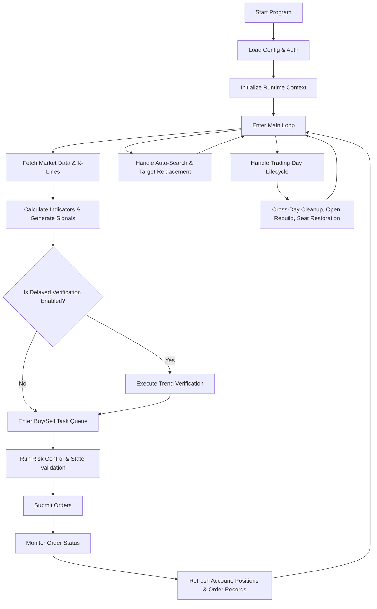

<div align="center">
  <h1>Hong Kong Stock Automated Trading System Based on Longbridge OpenAPI SDK</h1>
</div>

<p align="center">
  <a href="#project-introduction">Project Introduction</a> ·
  <a href="#important-notes">Important Notes</a> ·
  <a href="#developer-tips">Developer Tips</a> ·
  <a href="#system-description">System Description</a> ·
  <a href="#quick-start">Quick Start</a> ·
  <a href="#configuration-guide">Configuration Guide</a> ·
  <a href="#project-structure">Project Structure</a> ·
  <a href="#execution-flow">Execution Flow</a>
</p>

## Project Introduction

An automated trading project targeting the Hong Kong stock market. It monitors technical indicators of the target assets to generate trading signals and executes two-way trades on warrants, CBBCs (Callable Bull/Bear Contracts), or ETFs.

Primarily focused on intraday trading (mean reversion strategy), it continuously fetches market data and minute-level K-lines at runtime. Based on configuration, it calculates indicators, generates signals, executes orders, and updates account and position states. The monitored assets are typically used for analysis and may not necessarily be the actual traded instruments.

## Important Notes

> This project is experimental. It is open-sourced primarily for technical exchange and trading strategy research. It does not guarantee absolute code robustness, strategy profitability, or applicability to all market conditions.

> Please fully understand the basic risks associated with Hong Kong stocks, warrants, CBBCs, ETFs, technical indicators, and automated trading. Warrants and CBBCs come with built-in leverage, expiration dates, and call/recovery prices, making them significantly riskier than standard spot trading.

- The project typically **does not use ordinary shares as the main trading targets**; shares are more often used as monitored underlyings, while actual trades usually occur on derivatives like warrants, CBBCs, or ETFs.
- Hong Kong stocks and derivatives inherently have varying liquidity. When selecting targets, prioritize highly liquid monitored and traded instruments. Experience suggests focusing on large, liquid targets or index-based assets, such as `HSI.HK`.
- The current strategy leans towards **intraday swing trading**, calculating indicators based on real-time minute-level K-lines without relying on higher-timeframe analysis. This results in higher execution frequency, which also implies higher transaction and drawdown risks.
- The current strategy tends to work better in sideways/ranging markets. In strong trending markets, risk control relies more on stop-loss, cooldown, and exit mechanisms.
- Always test first using a **paper trading/simulated account**. It is not recommended to run directly on a live account.
- This project is aimed at users capable of reading and modifying code. It is especially recommended to be familiar with TypeScript, Bun, automated trading workflows, and the Longbridge OpenAPI before proceeding with custom development.
- The repository code is almost entirely co-generated by AI, with key parts primarily using Claude Opus 4.x and GPT-5.x Extra High. If you continue to refactor or develop further, it is recommended to use top-tier AI models to assist, but **architecture design and business logic judgment should still be handled by the developer**.

## Developer Tips

When collaborating with tools like Claude Code, Codex, or Cursor Agent, it is recommended to first read the [CLAUDE.md](./CLAUDE.md) file in the repository. This file provides unified guidance on Agent behavior boundaries, solution constraints, and project conventions.

The project currently includes the following built-in skills:

| Skill | Description | Applicable Scenarios |
| --- | --- | --- |
| `code-review` | Multi-perspective code review and simplification | Reviewing change quality, identifying dead code, type checking, comment verification, ensuring implementation aligns with plans and standards |
| `core-program-business-logic` | Hong Kong quantitative trading system business logic knowledge base | Understanding the trading pipeline, validating business rules, assisting with feature modifications and refactoring |
| `typescript-project-specifications` | Strict TypeScript coding standards | Uniformly follow project coding standards when writing, modifying, or refactoring `.ts` files |

> If you use an Agent to continue developing this project, it is recommended to treat the Agent as an implementation assistant rather than a business decision-maker. Business rules, architecture boundaries, and trading logic should be confirmed by the developer first, then handed over to the Agent for implementation.

## System Description

### 1. Monitoring, Indicators, and Signals

Monitors multiple underlyings simultaneously, each with independent configuration. At runtime, it calculates indicators like RSI, PSY, MFI, KDJ, etc., as needed based on signal conditions and verification configurations, and generates four types of trading signals when conditions are met: `BUYCALL`, `SELLCALL`, `BUYPUT`, `SELLPUT`.

When delayed verification is enabled, signals do not immediately enter the execution pipeline. Instead, they first enter a trend confirmation stage; only after passing verification do they enter the buy/sell task queue to filter out some instantaneous noise.

### 2. Ordering, Risk Control, and Exit

Before order execution, the system uniformly passes through gates including frequency limits, price limits, position constraints, cash checks, unrealized loss protection, CBBC risks, and expiry-day protection. Buy and sell orders follow different pipelines:

- The buy pipeline emphasizes pre-execution risk control and order pacing.
- The sell pipeline emphasizes intelligent position closure, protective liquidation, and order de-duplication.
- After order submission, the system continues to track unfilled orders, handling price chasing, cancellations, timeouts, and state progression.

### 3. Seats, Target Replacement, and Lifecycle

When automatic target search is enabled, the system maintains LONG and SHORT seats for each monitored underlying. The traded target is no longer hardcoded but dynamically determined at runtime based on configuration and candidate screening results. A cross-reference to the recovery price boundary can trigger a target replacement; when necessary, position rolling and replenishment will also be executed.

The system also includes built-in trading day lifecycle management: clearing running states at midnight, rebuilding at market open, restoring accounts and positions, rebuilding order records, and uniformly blocking trading until rebuilding is complete to prevent dirty states from persisting into the next trading day.

## Quick Start

### 1. Install Project

```bash
git clone https://github.com/zhengyongjie16/Longbridge_Quantitative_Trading.git
cd Longbridge_Quantitative_Trading
bun install
```

### 2. Create Local Configuration

```bash
cp .env.example .env.local
```

### 3. Minimal Configuration Example

```env
# Authentication (choose one)
LONGBRIDGE_AUTH_MODE=oauth
LONGBRIDGE_CLIENT_ID=your_longbridge_client_id
LONGBRIDGE_CALLBACK_PORT=60355

# Monitored Underlying 1
MONITOR_SYMBOL_1=9988.HK
LONG_SYMBOL_1=55131.HK
SHORT_SYMBOL_1=56614.HK
ORDER_OWNERSHIP_MAPPING_1=ALIBA

# Trading & Risk Control
TARGET_NOTIONAL_1=10000
MAX_POSITION_NOTIONAL_1=100000
MAX_UNREALIZED_LOSS_PER_SYMBOL_1=3000

# Signal Examples
SIGNAL_BUYCALL_1=(RSI:6<25,MFI<20,D<25,J<0)/3|(J<-20)
SIGNAL_SELLCALL_1=(RSI:6>75,MFI>80,D>75,J>100)/3|(J>110)
SIGNAL_BUYPUT_1=(RSI:6>75,MFI>80,D>75,J>100)/3|(J>120)
SIGNAL_SELLPUT_1=(RSI:6<25,MFI<20,D<25,J<0)/3|(J<-15)
```

> If using `oauth` mode and there is no valid token cache locally, the program will output an authorization URL in the terminal after startup. After authorization, the SDK will reuse and automatically refresh the token cache in the user directory, eliminating the need for repeated authorization.

### 4. Start

```bash
bun start
```

### 5. Common Commands

| Command                   | Description                              |
| ------------------------- | ---------------------------------------- |
| `bun start`               | Start production mode                    |
| `bun dev`                 | Start development mode (default still runs gate checks) |
| `bun dev:watch`           | Development watch mode                   |
| `bun build`               | Build TypeScript                         |
| `bun test`                | Run tests                                |
| `bun type-check`          | Run type checking                        |
| `bun lint`                | Run ESLint checks                        |
| `bun format`              | Run Prettier + ESLint auto-fix           |
| `bun clean`               | Clean build artifacts                    |
| `bun sonarqube`           | Run SonarQube analysis                   |
| `bun sonarqube:report`    | Get SonarQube report                     |

If you need to explicitly skip gate checks during development, you can use:

```bash
bunx cross-env STARTUP_GATE_MODE=skip bun dev
bunx cross-env RUNTIME_GATE_MODE=skip bun dev
bunx cross-env STARTUP_GATE_MODE=skip RUNTIME_GATE_MODE=skip bun dev
```

## Configuration Guide

The README only retains the most critical configuration rules. For complete parameters, please refer directly to [`./.env.example`](./.env.example).

### Authentication Mode

The system supports two authentication modes:

- `oauth`
- `apikey`

Only one can be selected per run.

### Multi-Underlying Configuration Rules

- Each monitored underlying must use continuous suffixes: `_1`, `_2`, `_3`...
- Monitored underlying indices must be continuous; if there is a gap, the program will directly throw a configuration error and terminate startup.
- `MONITOR_SYMBOL_N` denotes the monitored underlying; `LONG_SYMBOL_N` / `SHORT_SYMBOL_N` denote the corresponding directional traded targets.

### Automatic Target Search Explanation

If enabled:

```env
AUTO_SEARCH_ENABLED_1=true
```

The system will ignore the static configuration of `LONG_SYMBOL_1` and `SHORT_SYMBOL_1`, switching to dynamic target searching and replacement via the seat mechanism.

### Recommended Reading Order

1. First read `.env.example` to understand the full parameter list.
2. Then confirm the authentication method and underlying configurations.
3. Finally, fine-tune signal, risk control, and automatic target search parameters according to strategy needs.

## Project Structure

```text
src/
├── index.ts      # Thin entry point
├── app/          # Application assembly, startup, and rebuild workflows
├── config/       # Configuration parsing and validation
├── constants/    # Global constants
├── types/        # Common type definitions
├── main/         # Main loop, lifecycle, and async processing scheduler
├── core/         # Core business logic (strategies, risk control, trading, order records)
├── services/     # External services (market data, indicators, auto-search, account display, etc.)
└── utils/        # General utilities
```

## Execution Flow



Only the main chain at the README level is shown:

- The main loop is responsible for fetching market data, calculating indicators, generating signals, and dispatching tasks.
- Delayed verification is kept as a separate branch without detailing specific time points.
- Automatic target search/replacement and trading day lifecycle are auxiliary mechanisms running alongside the main loop.
- After orders are filled, the system refreshes the account, positions, order records, and related running states before proceeding to the next cycle.

## Logs

- Console: Real-time running status and key events.
- `logs/system/`: System-level logs.
- `logs/debug/`: Debug logs (more valuable when `DEBUG=true` is enabled).
- `logs/trades/YYYY-MM-DD.json`: Trade detail records.
- `logs/sdk/`: Longbridge SDK logs (output when relevant configurations are enabled).

## Related Resources

- [Longbridge OpenAPI Docs](https://open.longbridge.com/zh-CN/docs)
- [Longbridge OpenAPI LLM Components Docs](https://open.longbridge.com/docs/llm)
- [Longbridge OpenAPI SDK for Node.js Docs](https://longbridge.github.io/openapi/nodejs/index.html)
- [Bun Docs](https://bun.com/docs)
- [Claude Code Docs](https://code.claude.com/docs)
- [OpenAI Codex Docs](https://developers.openai.com/codex)
- [Vibe Coding Guide CN](https://github.com/2025Emma/vibe-coding-cn)

## License

- [MIT License (c) 2026](./LICENSE-MIT)
