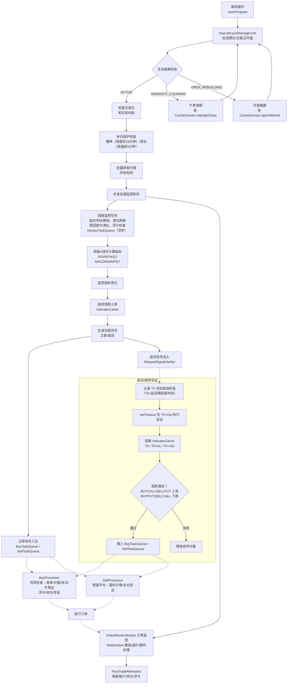

# LongBridge 证券港股自动化量化交易系统

## 项目简介及重要提示

### 项目介绍

基于 LongPort OpenAPI SDK / TypeScript 的港股自动化量化交易系统，通过监控目标资产（如HSI）的技术指标，在轮证/ETF上自动执行双向（做多/做空）交易。支持多指标组合策略、延迟验证、风险控制和订单管理。

### 重要提示（必读）

1. 该项目开源仅用作技术和交易策略上的交流，不保证程序完全严谨且正确，不保证策略的盈利性和普遍适用性。
2. 请先务必掌握港股、轮证以及技术指标的相关知识，轮证自带杠杆属性且存在到期时间和回收等机制，这些因素都存在较大风险。
3. 港股天然存在流动性问题，你选择的标的或轮证必须考虑流动性，选择的标的日均成交额应在30亿以上，轮证的日均成交额应在1000万以上。
4. 该程序一般不会交易正股（正股仅用作实时分析，即配置中的监控标的），而是在轮证/ETF等衍生品上进行多空交易，主要为交易做多或做空方向的权证或牛熊证，这存在较高风险。
5. 目前的交易策略仅针对日内交易，在交易时段内每秒获取分钟级k线进行技术指标的计算用于生成交易信号（虽然是获取分钟k线但最新的k线是实时变动的），由于通过交易轮证这样的高杠杆衍生品，所以不需要监控大周期的k线，但这也存在更高的风险。
6. 请务必掌握相关代码知识（主要为typescript），不建议非开发者使用。
7. 该程序代码几乎全部由vibe/spec coding（关键部分主要使用Claude Opus 4.x和GPT-5.x Codex Extra High模型）编写，请使用顶级模型进行重构和再开发，这是保证代码质量的关键。（注意：Agent仅用作代码实现，所有架构和业务逻辑应自行设计）。
8. 请务必使用模拟账户进行调试。

## 编码模型分级（由社区反馈，仅作参考）

建议选择第一梯队模型处理复杂任务，以确保代码质量与效率。

- **第一梯队**: `GPT-5.3-Codex-Extra-High`, `Claude-Opus-4.6`
- **第二梯队**: `Claude-Sonnet-4.5`, `Kimi-K2.5-Thinking`, `MiniMax-M2.5`, `GLM-5`, `Gemini-3-Pro`
- **第三梯队**: `Qwen-3.5`, `Grok-4`, `Deepseek-v3.2`

## 开发者提示

使用 Claude Code / Codex / Cursor Agent 开发时，可以使用 **[CLAUDE.md](./CLAUDE.md)** 对 Agent 进行宽约束和初步指导。具体参考下方「帮助」中的 Claude Code Docs。

### 内置 Skills

项目内置以下 skills，Agent 可根据任务自动调用：

| Skill                               | 说明                                        | 使用场景                                                                                       |
| ----------------------------------- | ------------------------------------------- | ---------------------------------------------------------------------------------------------- |
| `code-review`                       | 资深代码审查与代码简化综合技能              | 代码审查、实现与计划一致性检查、TypeScript 代码质量/架构/注释/类型设计评估、代码简化、代码清理 |
| `core-program-business-logic`       | 港股量化交易系统业务逻辑知识库              | 理解交易逻辑、验证代码实现、修改功能、解答业务规则；重构代码时应一并更新此文档                 |
| `longport-nodejs-sdk`               | LongPort OpenAPI SDK for Node.js 完整知识库 | 调用 LongPort API、查询 SDK 文档、处理行情/订单/资产                                           |
| `typescript-project-specifications` | TypeScript 严格代码规范                     | 编写/修改/重构 .ts 文件时自动使用，包含工厂函数、依赖注入、对象池等模式示例                    |

### 核心功能

| 功能               | 说明                                                                                                            |
| ------------------ | --------------------------------------------------------------------------------------------------------------- |
| 多标的支持         | 支持并发监控多个标的，每个标的独立配置                                                                          |
| 多指标组合         | RSI、PSY、MFI、KDJ 组合判断（MACD/EMA 仅用于延迟验证）                                                          |
| 双向交易           | 支持双向交易（做多和做空）                                                                                      |
| 延迟验证           | 买入/卖出信号均支持延迟验证（趋势验证）                                                                         |
| 异步处理           | 异步执行交易，不阻塞主循环                                                                                      |
| 智能风控           | 浮亏保护、持仓限制、牛熊证回收价检查                                                                            |
| 末日保护           | 收盘前15分钟拒绝买入并撤销未成交订单，收盘前5分钟自动清仓                                                       |
| 订单调整           | 自动监控和调整未成交订单价格（买入超时撤单，卖出超时转市价单）                                                  |
| 自动寻标/换标      | 启用后以"席位"动态决定牛/熊证交易标的；距回收价百分比越界触发自动换标（含预寻标与同标的日内抑制，可选移仓回补） |
| 交易日生命周期管理 | 自动检测跨日并执行午夜清理（清空运行时状态），交易日开盘时自动重建（恢复账户/持仓/订单/席位等），支持失败重试   |
| 内存优化           | 对象池复用减少 GC 压力，IndicatorCache 使用环形缓冲区                                                           |
| 卖出策略           | 智能平仓仅卖出盈利订单，无盈利则跳过（禁用时全仓卖出）                                                          |

---

## 快速开始

### 安装

```bash
git clone https://github.com/zhengyongjie16/Longbridge-Quantitative-Trading.git
```

```bash
cd Longbridge-Quantitative-Trading
```

```bash
bun install
```

### 创建配置文件

```bash
cp .env.example .env.local
```

### 配置必需参数 (.env.local)

系统支持多个监控标的，每个监控标的使用后缀 `_N`（N从1开始）区分配置，系统会自动检测存在的监控标的配置。

```env
# API 配置
LONGPORT_APP_KEY=your_key
LONGPORT_APP_SECRET=your_secret
LONGPORT_ACCESS_TOKEN=your_token
LONGPORT_REGION=hk    # 可选，默认 hk（cn 为中国大陆区域）

# 交易标的配置（使用后缀 _N，N从1开始，系统自动检测；标的必须为 ticker.region）
# 示例：第一个监控标的（_1）
MONITOR_SYMBOL_1=9988.HK    # 监控标的（阿里巴巴）
LONG_SYMBOL_1=55131.HK      # 做多标的（阿里摩通六甲牛G）
SHORT_SYMBOL_1=56614.HK     # 做空标的（阿里摩通六七熊A）
ORDER_OWNERSHIP_MAPPING_1=ALIBA  # 必需：订单归属映射（用于 stockName 归属解析/启动席位恢复）

# 交易参数(示例，接近取值)
TARGET_NOTIONAL_1=10000    # 每次买入金额（HKD）

# 风控参数(示例)
MAX_POSITION_NOTIONAL_1=200000  # 单标持仓上限
MAX_DAILY_LOSS_1=20000          # 单日亏损上限
MAX_UNREALIZED_LOSS_PER_SYMBOL_1=5000  # 单标浮亏保护阈值（0 表示禁用）

# 信号配置（示例，格式见下方）
SIGNAL_BUYCALL_1=(RSI:6<20,MFI<15,D<20,J<-1)/3|(J<-20)
SIGNAL_SELLCALL_1=(RSI:6>80,MFI>85,D>79,J>100)/3|(J>110)
SIGNAL_BUYPUT_1=(RSI:6>80,MFI>85,D>80,J>100)/3|(J>120)
SIGNAL_SELLPUT_1=(RSI:6<20,MFI<15,D<22,J<0)/3|(J<-15)

# 自动寻标（可选：启用后将忽略 LONG/SHORT_SYMBOL_1，由系统自动寻标并动态占位）
# AUTO_SEARCH_ENABLED_1=true
# 其余 AUTO_SEARCH_* 与 SWITCH_DISTANCE_RANGE_* 见下方"每个监控标的配置"或 `.env.example`

# 如需配置第二个监控标的，使用后缀 _2，以此类推
# MONITOR_SYMBOL_2=9988.HK
# LONG_SYMBOL_2=55131.HK
```

### 启动

```bash
bun start
```

常用命令：

- 开发：`bun run dev`（跳过门禁检查）
- 开发：`bun run dev:watch`
- 构建：`bun run build`
- 类型检查：`bun run type-check`
- 代码质量：`bun run sonarqube` / `bun run sonarqube:report`（需要 `.env.sonar`，可配合 `docker-compose.yml` 在本地启动）
- 其他：`bun run lint` / `bun run lint:fix` / `bun run clean`

---

## 信号配置格式

**格式**：`(条件1,条件2,...)/N|(条件A)|(条件B,条件C)/M`

- **括号内**：条件列表，逗号分隔
- **/N**：括号内条件需满足 N 项
- **|**：分隔条件组，满足任一组即可
- **指标**：
  - `RSI:n`：任意周期 RSI（n 范围 1-100），如 `RSI:6<20`
  - `PSY:n`：任意周期 PSY（n 范围 1-100），如 `PSY:12>50`
  - `MFI`：资金流量指标
  - `K`、`D`、`J`：KDJ 指标
- **运算符**：`<`、`>`
- **条件组数量**：最多 3 组，满足任一组即可

> **说明**：`EMA:n`、`MACD`、`DIF`、`DEA` 仅用于延迟验证指标，不支持用于信号配置。

### 交易策略

#### 信号生成与验证流程

系统支持延迟验证，是否延迟由配置决定：延迟时间为 0 或验证指标为空则为立即信号，否则进入延迟验证流程。

**四种信号类型**：

| 信号     | 类型     | 环境变量            | 延迟验证规则                                                       |
| -------- | -------- | ------------------- | ------------------------------------------------------------------ |
| BUYCALL  | 买入做多 | `SIGNAL_BUYCALL_N`  | T0、T0+5s、T0+10s 三个时间点的指标值均需**大于**初始值（上涨趋势） |
| SELLCALL | 卖出做多 | `SIGNAL_SELLCALL_N` | T0、T0+5s、T0+10s 三个时间点的指标值均需**小于**初始值（下跌趋势） |
| BUYPUT   | 买入做空 | `SIGNAL_BUYPUT_N`   | T0、T0+5s、T0+10s 三个时间点的指标值均需**小于**初始值（下跌趋势） |
| SELLPUT  | 卖出做空 | `SIGNAL_SELLPUT_N`  | T0、T0+5s、T0+10s 三个时间点的指标值均需**大于**初始值（上涨趋势） |

> **注意**：环境变量中的 `N` 表示监控标的索引（如 `_1`、`_2`）。买入和卖出的延迟验证时间（默认60秒）、验证指标可独立配置。

**延迟验证机制**：

1. 信号生成时记录初始指标值，并设定 T0（延迟期结束时刻）
2. 主循环每秒保存指标快照，供后续验证使用
3. 在 T0+10s 执行验证，检查 T0 / T0+5s / T0+10s 三点趋势（允许 ±5 秒误差）
4. 验证通过进入交易执行流程，失败则丢弃该信号

#### 买入策略

1. **信号生成**：监控标的技术指标满足配置条件时，生成买入信号（立即/延迟）
2. **延迟验证**：若启用延迟验证，按配置在延迟期后验证三点趋势
3. **异步执行**：验证通过后进入异步执行流程
4. **风险检查**：频率限制、价格限制、末日保护、牛熊证风险、浮亏/持仓/现金限制
5. **订单执行**：按目标金额计算买入数量并提交订单（订单类型可配置）

#### 卖出策略

1. **信号生成**：监控标的技术指标满足配置条件，且存在买入订单记录时，生成卖出信号（立即/延迟）
2. **延迟验证**：若启用延迟验证，需通过趋势验证后进入执行流程
3. **智能平仓判断**：启用时仅卖出盈利订单（无盈利订单则跳过），禁用时直接全仓卖出
4. **特殊规则**：末日保护清仓无条件执行，不受智能平仓影响
5. **订单执行**：按卖出数量提交订单，清仓订单可与常规订单类型不同

---

## 风险控制

### 买入检查顺序

先经**风险检查冷却**（同标的同方向 10 秒内仅允许一信号进入下列检查），再依次：

1. **交易频率限制**：同方向买入间隔（默认 60 秒）
2. **清仓冷却**：保护性清仓后冷却期内拒绝买入
3. **买入价格限制**：当前价 > 最新买入订单成交价时拒绝（防止追高）
4. **末日保护**：收盘前 15 分钟（默认）拒绝买入
5. **牛熊证风险**：牛证距回收价 ≥ 0.35%（默认），熊证 ≤ -0.35%（默认），牛熊证当前价 > 0.015（默认）
6. **基础风险检查**：浮亏限制、持仓市值限制、港币可用现金

### 实时检查

1. **实时浮亏检查**：浮亏超过阈值触发保护性清仓
2. **实时牛熊证回收价检查**：针对牛熊证会实时检查距回收价范围，超过阈值会保护性清仓

### 可选配置

**全局配置**：

| 参数                                   | 默认值  | 说明                                                   |
| -------------------------------------- | ------- | ------------------------------------------------------ |
| `LONGPORT_REGION`                      | `hk`    | API 区域配置（`cn`=中国大陆，`hk`=香港及其他）         |
| `DOOMSDAY_PROTECTION`                  | `true`  | 启用末日保护                                           |
| `MORNING_OPENING_PROTECTION_ENABLED`   | `false` | 早盘 09:30 起 N 分钟内暂停信号生成                     |
| `MORNING_OPENING_PROTECTION_MINUTES`   | `15`    | 早盘开盘保护时长（分钟，范围1-60，启用时必填）         |
| `AFTERNOON_OPENING_PROTECTION_ENABLED` | `false` | 午盘 13:00 起 N 分钟内暂停信号生成（半日市不生效）     |
| `AFTERNOON_OPENING_PROTECTION_MINUTES` | `15`    | 午盘开盘保护时长（分钟，范围1-60，启用时必填）         |
| `DEBUG`                                | `false` | 启用调试日志                                           |
| `TRADING_ORDER_TYPE`                   | `ELO`   | 交易订单类型（LO 限价单 / ELO 增强限价单 / MO 市价单） |
| `LIQUIDATION_ORDER_TYPE`               | `MO`    | 清仓订单类型（LO / ELO / MO）                          |
| `BUY_ORDER_TIMEOUT_ENABLED`            | `true`  | 启用买入订单超时检测（超时后撤单）                     |
| `BUY_ORDER_TIMEOUT_SECONDS`            | `180`   | 买入订单超时时间（秒，范围30-600）                     |
| `SELL_ORDER_TIMEOUT_ENABLED`           | `true`  | 启用卖出订单超时检测（超时后转市价单）                 |
| `SELL_ORDER_TIMEOUT_SECONDS`           | `180`   | 卖出订单超时时间（秒，范围30-600）                     |
| `ORDER_MONITOR_PRICE_UPDATE_INTERVAL`  | `5`     | 订单价格更新间隔（秒，范围1-60）                       |

**每个监控标的配置**（使用后缀 `_N`，如 `_1`、`_2`）：

| 参数                                         | 默认值   | 说明                                                                                                   |
| -------------------------------------------- | -------- | ------------------------------------------------------------------------------------------------------ |
| `MAX_UNREALIZED_LOSS_PER_SYMBOL_N`           | `0`      | 单标浮亏保护阈值（0表示禁用）                                                                          |
| `VERIFICATION_DELAY_SECONDS_BUY_N`           | `60`     | 买入延迟验证时间（秒，范围0-120）                                                                      |
| `VERIFICATION_INDICATORS_BUY_N`              | `K,MACD` | 买入验证指标（逗号分隔，可选：K/D/J/MACD/DIF/DEA/EMA:n/PSY:n）                                         |
| `VERIFICATION_DELAY_SECONDS_SELL_N`          | `60`     | 卖出延迟验证时间（秒，范围0-120）                                                                      |
| `VERIFICATION_INDICATORS_SELL_N`             | `K,MACD` | 卖出验证指标（逗号分隔，可选：K/D/J/MACD/DIF/DEA/EMA:n/PSY:n）                                         |
| `BUY_INTERVAL_SECONDS_N`                     | `60`     | 同向买入间隔（秒，范围10-600）                                                                         |
| `LIQUIDATION_COOLDOWN_MINUTES_N`             | `无`     | 保护性清仓后买入冷却（可选，不设置则不冷却：1-120 / half-day / one-day）                               |
| `SMART_CLOSE_ENABLED_N`                      | `true`   | 智能平仓开关（启用时仅卖出盈利订单，禁用时全仓卖出）                                                   |
| `AUTO_SEARCH_ENABLED_N`                      | `false`  | 自动寻标开关（启用后忽略 LONG/SHORT 标的配置）                                                         |
| `ORDER_OWNERSHIP_MAPPING_N`                  | `无`     | **必需**：stockName 归属缩写映射（逗号分隔），用于订单归属解析与启动席位恢复；不同监控标的别名不可冲突 |
| `AUTO_SEARCH_MIN_DISTANCE_PCT_BULL_N`        | `无`     | 牛证最低距回收价百分比阈值（正值）                                                                     |
| `AUTO_SEARCH_MIN_DISTANCE_PCT_BEAR_N`        | `无`     | 熊证最低距回收价百分比阈值（负值）                                                                     |
| `AUTO_SEARCH_MIN_TURNOVER_PER_MINUTE_BULL_N` | `无`     | 牛证分均成交额阈值（HKD/分钟）                                                                         |
| `AUTO_SEARCH_MIN_TURNOVER_PER_MINUTE_BEAR_N` | `无`     | 熊证分均成交额阈值（HKD/分钟）                                                                         |
| `AUTO_SEARCH_EXPIRY_MIN_MONTHS_N`            | `3`      | 到期日最小月份                                                                                         |
| `AUTO_SEARCH_OPEN_DELAY_MINUTES_N`           | `5`      | 早盘开盘延迟分钟数（仅早盘生效）                                                                       |
| `SWITCH_DISTANCE_RANGE_BULL_N`               | `无`     | 牛证距回收价换标范围（格式 min,max，包含等于）                                                         |
| `SWITCH_DISTANCE_RANGE_BEAR_N`               | `无`     | 熊证距回收价换标范围（格式 min,max，包含等于）                                                         |

#### 自动寻标/自动换标（席位机制）说明

启用 `AUTO_SEARCH_ENABLED_N=true` 后，系统会为每个监控标的维护 **两张席位（LONG=牛证 / SHORT=熊证）**，交易标的由席位动态决定：

- **席位状态**：`READY / SEARCHING / SWITCHING / EMPTY`
  - `READY`：可交易；`SEARCHING/SWITCHING`：处理中；`EMPTY`：无标的，该方向信号会被丢弃/不入队（直到寻标成功）
- **启动恢复**：启动时按"历史订单（`ORDER_OWNERSHIP_MAPPING_N`）+ 持仓"恢复席位；无法确认则置 `EMPTY`，由后续寻标补齐。
- **自动寻标触发**：仅在"席位 `EMPTY` + 交易时段"时尝试，并受 **30 秒冷却** 与 **早盘延迟**（`AUTO_SEARCH_OPEN_DELAY_MINUTES_N`，仅早盘生效）约束；阈值缺失会跳过寻标。
- **自动寻标筛选**：基于 LongPort `warrantList` 筛选牛/熊证：到期（`AUTO_SEARCH_EXPIRY_MIN_MONTHS_N`）、距回收价百分比（`AUTO_SEARCH_MIN_DISTANCE_PCT_*`）、分均成交额（`AUTO_SEARCH_MIN_TURNOVER_PER_MINUTE_*`）；选优：**|距回收价百分比|更小优先**，相同取 **分均成交额更高**。
- **自动换标触发**：监控价变化触发检查，若"距回收价百分比"满足 `<=min` 或 `>=max`（`SWITCH_DISTANCE_RANGE_*`，含边界）则进入换标。
- **换标流程（状态机）**：先 **预寻标**，候选与旧标一致则记录"同标的日内抑制"并停止；否则撤销旧标未完成买入挂单 → 有持仓则移仓卖出（ELO）→ 占位新标；若换标前有持仓可按"真实卖出成交额（优先）或 `TARGET_NOTIONAL_N`"回补买入（ELO）。
- **版本号隔离（关键）**：换标会递增席位版本号；延迟验证/队列/订单跟踪处理前校验版本，不匹配直接丢弃，防止误用旧标的。

**清仓冷却说明（香港时间）**：
`LIQUIDATION_COOLDOWN_MINUTES_N` 未设置则不启用冷却；`half-day` 为上午触发冷却到 13:00、下午触发则当日不再买入；`one-day` 为当日不再买入。

---

## 系统架构

```
src/
├── index.ts                        # 主入口（每秒循环）
├── config/                         # 配置模块
├── constants/                      # 全局常量定义
├── types/                          # TypeScript 类型定义
├── main/                           # 主程序架构模块
│   ├── startup/                    # 启动流程（运行门禁/席位恢复与初始寻标）
│   ├── mainProgram/                # 主循环逻辑
│   ├── processMonitor/             # 单标的处理
│   ├── lifecycle/                  # 交易日生命周期管理
│   └── asyncProgram/               # 异步任务处理
│       ├── indicatorCache/         # 指标缓存（环形缓冲区存储历史快照）
│       ├── delayedSignalVerifier/  # 延迟信号验证器（setTimeout 计时验证）
│       ├── monitorTaskQueue/       # 监控任务队列（autoSymbol/席位刷新/距回收价清仓/浮亏检查）
│       ├── monitorTaskProcessor/   # 监控任务处理器（异步消费 monitorTaskQueue）
│       ├── tradeTaskQueue/         # 买入/卖出任务队列
│       ├── buyProcessor/           # 买入处理器
│       ├── sellProcessor/          # 卖出处理器
│       ├── orderMonitorWorker/     # 订单监控工作线程（WebSocket 推送 + 价格调整/超时处理）
│       └── postTradeRefresher/     # 成交后刷新（账户/持仓/浮亏缓存）
├── core/                           # 核心业务逻辑
│   ├── strategy/                   # 信号生成
│   ├── signalProcessor/            # 风险检查与卖出计算
│   ├── riskController/             # 风险检查（持仓/亏损/牛熊证/浮亏监控等）
│   ├── trader/                     # 订单执行与监控
│   ├── orderRecorder/              # 订单记录与查询
│   └── doomsdayProtection/         # 末日保护（收盘前清仓）
├── services/                       # 外部服务
│   ├── quoteClient/                # 行情数据客户端
│   ├── marketMonitor/              # 市场监控（价格/指标变化）
│   ├── monitorContext/             # 监控上下文工厂
│   ├── autoSymbolFinder/           # 自动寻标（筛选牛/熊证候选）
│   ├── autoSymbolManager/          # 席位管理（寻标/换标状态机）
│   ├── liquidationCooldown/        # 保护性清仓后的买入冷却
│   ├── cleanup/                    # 退出清理
│   └── indicators/                 # 技术指标计算（RSI/KDJ/MACD/MFI/EMA/PSY）
└── utils/                          # 工具模块
    ├── refreshGate/                # 刷新门禁（等待账户/持仓等缓存"足够新"）
    ├── objectPool/                 # 对象池（减少 GC）
    ├── logger/                     # 日志系统（pino）
    ├── asciiArt/                   # 启动 ASCII 艺术字
    └── helpers/                    # 辅助工具
```

---

## 运行流程



---

## 日志

- **控制台**：实时运行状态
- **文件**：`logs/system/`、`logs/debug/`（需配置 `DEBUG=true`）
- **交易记录**：`logs/trades/YYYY-MM-DD.json`（JSON 交易明细）

---

## 帮助

- [Longbridge OpenAPI Docs](https://open.longbridge.com/zh-CN/docs)
- [Longbridge OpenAPI LLM Components Docs](https://open.longbridge.com/docs/llm)
- [LongPort OpenAPI SDK for Node.js Docs](https://longportapp.github.io/openapi/nodejs/)
- [Claude Code Docs](https://code.claude.com/docs)
- [Bun Apps Docs](https://bun.com/docs)
- [Vibe Coding Guide CN](https://github.com/2025Emma/vibe-coding-cn)

---

## 许可证

- Apache License, Version 2.0, [2025-2026], ([LICENSE-APACHE](./LICENSE-APACHE))
- MIT License (c) 2025-2026, ([LICENSE-MIT](./LICENSE-MIT))
