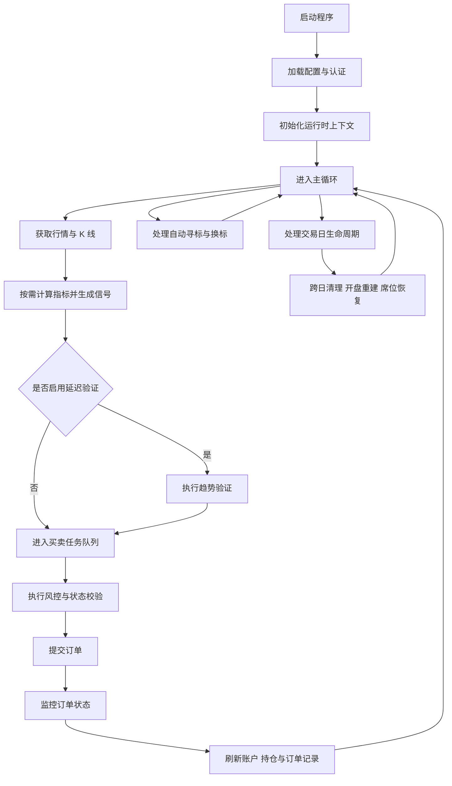

<div align="center">
  <h1>基于 Longbridge OpenAPI SDK 港股自动化交易系统</h1>
</div>

<p align="center">
  <a href="#项目简介">项目简介</a> ·
  <a href="#重要提示">重要提示</a> ·
  <a href="#开发者提示">开发者提示</a> ·
  <a href="#系统说明">系统说明</a> ·
  <a href="#快速开始">快速开始</a> ·
  <a href="#配置说明">配置说明</a> ·
  <a href="#项目结构">项目结构</a> ·
  <a href="#运行流程">运行流程</a>
</p>

## 项目简介

针对港股市场的自动化交易项目，通过监控标的的技术指标生成交易信号，并在轮证、牛熊证或 ETF 等交易标的上执行双向交易。

以日内交易为主（均值回归策略），运行时持续获取行情与分钟级 K 线，按配置计算指标、生成信号、执行订单并更新账户与持仓状态。监控标的通常用于分析，不一定直接作为实际成交标的。

## 重要提示

> 该项目是实验性项目，开源主要用于技术交流与交易策略研究，不保证程序绝对严谨，不保证策略盈利，也不保证其对所有市场环境都适用。

> 请务必理解港股、轮证、牛熊证、ETF、技术指标以及自动化交易的基本风险。轮证和牛熊证自带杠杆、到期、回收价等机制，风险显著高于一般现货交易。

- 项目通常**不会以正股作为主要交易对象**；正股更多作为监控标的，实际交易通常发生在轮证、牛熊证或 ETF 等衍生品上。
- 港股及衍生品天然存在流动性差异，选标时应优先考虑成交活跃的监控标的与交易标的。当前经验上，更适合优先关注流动性较好的大标的或指数类资产，例如 `HSI.HK`。
- 当前策略偏向**日内波段**，通过实时变动的分钟级 K 线计算指标，不依赖大周期分析。这种方式执行频率更高，也意味着更高的交易与回撤风险。
- 当前策略在震荡行情中更容易发挥作用，在单边行情中更多依赖止损、冷却和退出机制控制风险。
- 请务必先使用**模拟账户**调试，不建议直接在真实账户中试运行。
- 本项目面向具备代码阅读与改造能力的使用者，尤其建议熟悉 TypeScript、Bun、自动化交易流程以及 Longbridge OpenAPI 后再进行二次开发。
- 仓库代码几乎全部由 AI 协同生成，关键部分主要使用 Claude Opus 4.x 与 GPT-5.x Extra High。若要继续重构或再开发，建议使用顶级模型辅助，但**架构设计与业务逻辑判断仍应由开发者负责**。

## 开发者提示

使用 Claude Code、Codex、Cursor Agent 等工具协作开发时，建议优先阅读仓库中的 [CLAUDE.md](./CLAUDE.md)。该文件用于对 Agent 的行为边界、方案约束与项目约定提供统一指导。

项目当前内置以下 skills：

| Skill | 说明 | 适用场景 |
| --- | --- | --- |
| `code-review` | 多视角代码审查与代码简化能力 | 审查改动质量、识别死代码、类型检查、注释检查、检查实现是否符合计划与规范 |
| `core-program-business-logic` | 港股量化交易系统业务逻辑知识库 | 理解交易链路、校验业务规则、辅助功能修改与重构 |
| `typescript-project-specifications` | TypeScript 严格代码规范 | 编写、修改或重构 `.ts` 文件时统一遵循项目代码规范 |

> 如果你使用 Agent 继续开发本项目，推荐把 Agent 当作实现助手，而不是业务决策者。业务规则、架构边界和交易逻辑应先由开发者确认，再交给 Agent 落地。

## 系统说明

### 1. 监控、指标与信号

同时监控多个标的，每个标的都拥有独立配置。运行时会根据信号条件和验证配置按需计算 RSI、PSY、MFI、KDJ 等指标，并在满足条件时生成四类交易信号：`BUYCALL`、`SELLCALL`、`BUYPUT`、`SELLPUT`。

当启用延迟验证时，信号不会立即进入执行链路，而是先进入趋势确认阶段；验证通过后才会进入买卖任务队列，以过滤部分瞬时噪音。

### 2. 下单、风控与退出

交易执行前，系统会统一经过频率限制、价格限制、持仓约束、现金检查、浮亏保护、牛熊证风险、末日保护等门禁。买单与卖单走不同链路：

- 买入链路更强调前置风险控制与下单节奏控制。
- 卖出链路更强调智能平仓、保护性清仓和订单占用防重。
- 订单提交后，系统会继续跟踪未成交订单，处理追价、撤单、超时与状态推进。

### 3. 席位、换标与生命周期

启用自动寻标后，系统会为每个监控标的维护 LONG / SHORT 两个方向的席位，交易标的不再写死，而是由运行时根据配置和候选筛选结果动态决定。距离回收价越界时可触发换标，必要时还会执行移仓和回补。

系统还内置交易日生命周期管理：午夜清理运行态、开盘时执行重建、恢复账户与持仓、重建订单记录，并在重建完成前统一阻断交易，避免脏状态延续到下一交易日。

## 快速开始

### 1. 安装项目

```bash
git clone https://github.com/zhengyongjie16/Longbridge_Quantitative_Trading.git
cd Longbridge_Quantitative_Trading
bun install
```

### 2. 创建本地配置

```bash
cp .env.example .env.local
```

### 3. 最小配置示例

```env
# 认证（二选一）
LONGBRIDGE_AUTH_MODE=oauth
LONGBRIDGE_CLIENT_ID=your_longbridge_client_id
LONGBRIDGE_CALLBACK_PORT=60355

# 监控标的 1
MONITOR_SYMBOL_1=9988.HK
LONG_SYMBOL_1=55131.HK
SHORT_SYMBOL_1=56614.HK
ORDER_OWNERSHIP_MAPPING_1=ALIBA

# 交易与风控
TARGET_NOTIONAL_1=10000
MAX_POSITION_NOTIONAL_1=100000
MAX_UNREALIZED_LOSS_PER_SYMBOL_1=3000

# 信号示例
SIGNAL_BUYCALL_1=(RSI:6<25,MFI<20,D<25,J<0)/3|(J<-20)
SIGNAL_SELLCALL_1=(RSI:6>75,MFI>80,D>75,J>100)/3|(J>110)
SIGNAL_BUYPUT_1=(RSI:6>75,MFI>80,D>75,J>100)/3|(J>120)
SIGNAL_SELLPUT_1=(RSI:6<25,MFI<20,D<25,J<0)/3|(J<-15)
```

> 如果使用 `oauth` 模式且本地没有有效 token cache，程序启动后会在终端输出授权 URL。授权完成后，SDK 会复用并自动刷新用户目录下的 token cache，后续无需重复授权。

### 4. 启动

```bash
bun start
```

### 5. 常用命令

| 命令                   | 说明                               |
| ---------------------- | ---------------------------------- |
| `bun start`            | 启动正式运行                       |
| `bun dev`              | 开发模式启动（默认仍执行门禁检查） |
| `bun dev:watch`        | 开发监听                           |
| `bun build`            | 构建 TypeScript                    |
| `bun test`             | 运行测试                           |
| `bun type-check`       | 执行类型检查                       |
| `bun lint`             | 执行 ESLint 检查                   |
| `bun format`           | 执行 Prettier + ESLint 自动修复    |
| `bun clean`            | 清理构建产物                       |
| `bun sonarqube`        | 运行 SonarQube 分析                |
| `bun sonarqube:report` | 获取 SonarQube 报告                |

如果你需要显式跳过门禁检查，可在开发阶段使用：

```bash
bunx cross-env STARTUP_GATE_MODE=skip bun dev
bunx cross-env RUNTIME_GATE_MODE=skip bun dev
bunx cross-env STARTUP_GATE_MODE=skip RUNTIME_GATE_MODE=skip bun dev
```

## 配置说明

README 只保留最关键的配置规则，完整参数请直接阅读 [`./.env.example`](./.env.example)。

### 认证方式

系统支持两种认证模式：

- `oauth`
- `apikey`

单次运行只能选择其中一种。

### 多标的配置规则

- 每个监控标的必须使用连续后缀：`_1`、`_2`、`_3`...
- 监控标的索引必须连续；如果中间出现断档，程序会直接报配置错误并终止启动。
- `MONITOR_SYMBOL_N` 表示监控标的；`LONG_SYMBOL_N` / `SHORT_SYMBOL_N` 表示对应方向的交易标的。

### 自动寻标说明

如果启用：

```env
AUTO_SEARCH_ENABLED_1=true
```

系统会忽略 `LONG_SYMBOL_1` 与 `SHORT_SYMBOL_1` 的静态配置，改为通过席位机制动态寻标与换标。

### 推荐的阅读顺序

1. 先读 `.env.example` 了解完整参数
2. 再确认自认证方式与标的配置
3. 最后根据策略需要微调信号、风控与自动寻标相关参数

## 项目结构

```text
src/
├── index.ts      # 薄入口
├── app/          # 应用组装、启动与重建流程
├── config/       # 配置解析与校验
├── constants/    # 全局常量
├── types/        # 公共类型定义
├── main/         # 主循环、生命周期与异步处理调度
├── core/         # 核心业务逻辑（策略、风控、交易、订单记录）
├── services/     # 行情、指标、自动寻标、账户展示等外部服务
└── utils/        # 通用工具
```

## 运行流程


```mermaid
flowchart TD
    A[启动程序] --> B[加载配置与认证]
    B --> C[初始化运行时上下文]
    C --> D[进入主循环]

    D --> E[获取行情与 K 线]
    E --> F[按需计算指标并生成信号]
    F --> G{是否启用延迟验证}
    G -- 否 --> H[进入买卖任务队列]
    G -- 是 --> I[执行趋势验证]
    I --> H

    H --> J[执行风控与状态校验]
    J --> K[提交订单]
    K --> L[监控订单状态]
    L --> M[刷新账户 持仓与订单记录]
    M --> D

    D --> N[处理自动寻标与换标]
    N --> D

    D --> O[处理交易日生命周期]
    O --> P[跨日清理 开盘重建 席位恢复]
    P --> D
```

仅展示 README 层面的主链路：

- 主循环负责行情拉取、指标计算、信号生成和任务分发
- 延迟验证只保留为一条独立支线，不展开具体时间点细节
- 自动寻标 / 换标与交易日生命周期属于伴随主循环运行的辅助机制
- 订单成交后，系统会刷新账户、持仓、订单记录以及相关运行态，再进入下一轮处理

## 日志

- 控制台：实时运行状态与关键事件
- `logs/system/`：系统级日志
- `logs/debug/`：调试日志（启用 `DEBUG=true` 时更有价值）
- `logs/trades/YYYY-MM-DD.json`：交易明细记录
- `logs/sdk/`：Longbridge SDK 日志（启用相关配置时输出）

## 相关资源

- [Longbridge OpenAPI Docs](https://open.longbridge.com/zh-CN/docs)
- [Longbridge OpenAPI LLM Components Docs](https://open.longbridge.com/docs/llm)
- [Longbridge OpenAPI SDK for Node.js Docs](https://longbridge.github.io/openapi/nodejs/index.html)
- [Bun Docs](https://bun.com/docs)
- [Claude Code Docs](https://code.claude.com/docs)
- [OpenAI Codex Docs](https://developers.openai.com/codex)
- [Vibe Coding Guide CN](https://github.com/2025Emma/vibe-coding-cn)

## 许可证

- [MIT License (c) 2026](./LICENSE-MIT)
