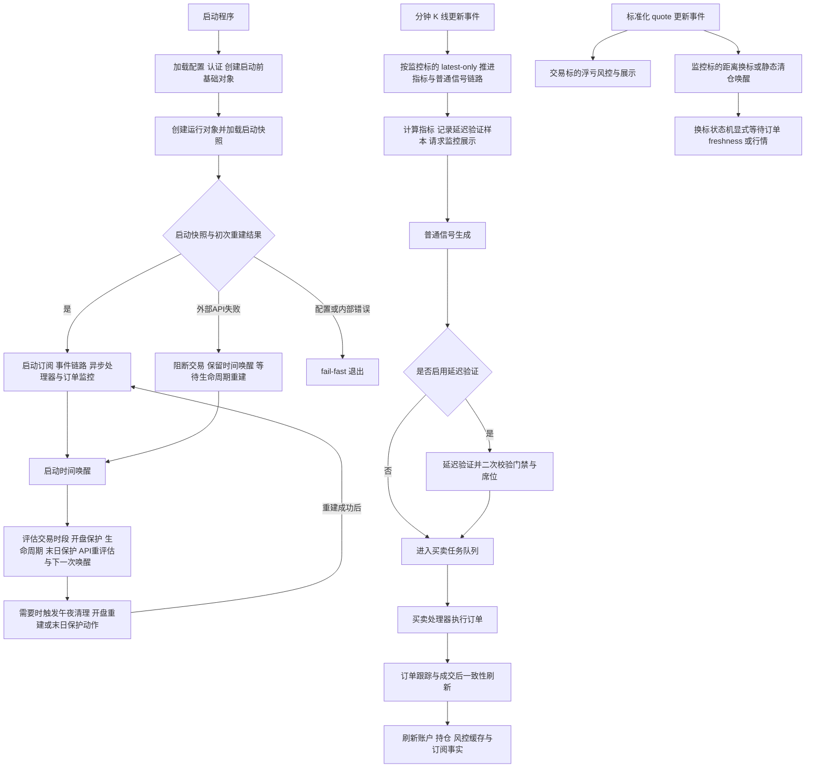

<div align="center">
  <h1>基于 Longbridge OpenAPI SDK 港股自动化交易系统</h1>
</div>

<p align="center">
  <a href="#项目简介">项目简介</a> ·
  <a href="#重要提示">重要提示</a> ·
  <a href="#开发者提示">开发者提示</a> ·
  <a href="#系统说明">系统说明</a> ·
  <a href="#快速开始">快速开始</a> ·
  <a href="#配置说明">配置说明</a> ·
  <a href="#项目结构">项目结构</a> ·
  <a href="#运行流程">运行流程</a>
</p>

## 项目简介

针对港股市场的自动化交易项目，通过监控标的的技术指标生成交易信号，并在轮证、牛熊证或 ETF 等交易标的上执行双向交易。

系统当前采用“系统级一次性时间唤醒 + 行情事件运行时 + 局部一次性唤醒 + 异步处理器”协同架构：系统级时间唤醒只在交易时段边界、开盘保护边界、末日保护窗口、跨日生命周期和 API 重评估点到达时执行一次权威时间评估；分钟级 K 线更新负责推进指标、记录延迟验证样本并生成普通信号；标准化 quote 更新事件驱动交易标的浮亏风控、监控标的距离换标或静态清仓以及展示刷新；局部一次性唤醒负责自动寻标、周期换标和换标等待推进。监控标的通常用于分析，不一定直接作为实际成交标的。

## 重要提示

> 该项目是实验性项目，开源主要用于技术交流与交易策略研究，不保证程序绝对严谨，不保证策略盈利，也不保证其对所有市场环境都适用。

> 请务必理解港股、轮证、牛熊证、ETF、技术指标以及自动化交易的基本风险。轮证和牛熊证自带杠杆、到期、回收价等机制，风险显著高于一般现货交易。

- 项目通常**不会以正股作为主要交易对象**；正股更多作为监控标的，实际交易通常发生在轮证、牛熊证或 ETF 等衍生品上。
- 港股及衍生品天然存在流动性差异，选标时应优先考虑成交活跃的监控标的与交易标的。当前经验上，更适合优先关注流动性较好的大标的或指数类资产，例如 `HSI.HK`。
- 当前策略偏向**日内波段**，通过实时变动的分钟级 K 线计算指标，不依赖大周期分析。这种方式执行频率更高，也意味着更高的交易与回撤风险。
- 当前策略在震荡行情中更容易发挥作用，在单边行情中更多依赖止损、冷却和退出机制控制风险。
- 请务必先使用**模拟账户**调试，不建议直接在真实账户中试运行。
- 本项目面向具备代码阅读与改造能力的使用者，尤其建议熟悉 TypeScript、Bun、自动化交易流程以及 Longbridge OpenAPI 后再进行二次开发。
- 仓库代码几乎全部由 AI 协同生成，关键部分主要使用 Claude Opus 4.x 与 GPT-5.x Extra High。若要继续重构或再开发，建议使用顶级模型辅助，但**架构设计与业务逻辑判断仍应由开发者负责**。

## 开发者提示

使用 Claude Code、Codex、Cursor Agent 等工具协作开发时，建议优先阅读仓库中的 [CLAUDE.md](./CLAUDE.md)。该文件用于对 Agent 的行为边界、方案约束与项目约定提供统一指导。

项目当前内置以下 skills：

| Skill | 说明 | 适用场景 |
| --- | --- | --- |
| `code-review` | 多视角代码审查与代码简化能力 | 审查改动质量、识别死代码、类型检查、注释检查、检查实现是否符合计划与规范 |
| `core-program-business-logic` | 港股量化交易系统业务逻辑知识库 | 理解交易链路、校验业务规则、辅助功能修改与重构 |
| `typescript-project-specifications` | TypeScript 严格代码规范 | 编写、修改或重构 `.ts` 文件时统一遵循项目代码规范 |

> 如果你使用 Agent 继续开发本项目，推荐把 Agent 当作实现助手，而不是业务决策者。业务规则、架构边界和交易逻辑应先由开发者确认，再交给 Agent 落地。

## 系统说明

### 1. 指标、信号与事件分流

同时监控多个标的，每个标的都拥有独立配置。系统会在监控标的的分钟级 K 线更新事件到达时，按单个监控标的 single-flight、latest-only 的方式推进指标计算；指标从本地 K 线缓存增量推进，成功后写入最新监控快照和延迟验证样本，再按当前 ACTIVE 席位投影生成四类普通信号：买入做多、卖出做多、买入做空、卖出做空。

当启用延迟验证时，普通信号不会直接进入执行队列，而是先进入对应监控标的的延迟验证环节；验证器在配置延迟到达后再等待样本就绪，读取触发点、触发后 5 秒、触发后 10 秒三组缓存样本做趋势验证；验证通过后，再次校验普通信号门禁与席位一致性，然后按买卖方向分流到买入或卖出执行队列。普通信号链路统一复用生命周期门禁、连续交易时段门禁和末日保护清仓接管窗口；开盘保护只会暂停新的普通信号生成与延迟验证登记，不阻断启动、订阅、自动寻标、换标或实时风控。

### 2. 执行、风控与事件运行时

买单与卖单保持独立异步执行链路：

- 买入链路会在执行时重新读取行情，并经过风控检查、资金/持仓约束、频率限制等门禁后再提交订单。
- 卖出链路独立于买入风控，先等待成交后一致性 freshness，再按执行时行情计算智能平仓、保护性清仓、卖出数量与订单占用防重；执行行情短暂缺失时只对当前卖出任务做有界延后重试。
- 订单提交后，订单监控运行时会继续处理追价、撤单、超时、终态结算与持仓刷新。

除普通信号外，系统还维护多条独立事件链路：稳态行情订阅由统一的订阅运行时持有，并根据监控标的、席位绑定、持仓、在途订单和临时等待原因汇总出最终订阅集合；交易标的 quote 更新进入浮亏风控，并在通过生命周期门禁、成交后 freshness 和席位路由校验后触发保护性处理；监控标的 quote 更新进入监控 quote 运行时，在自动寻标开启时驱动距离换标，在关闭时接管静态距回收价清仓及其等待唤醒。展示输出拆分为监控指标展示和交易标的展示，均采用 latest-only 异步刷新，不阻塞指标推进、信号分流或下单。成交后一致性链路会在账户、持仓、保护性清仓状态、亏损分段和浮亏缓存刷新完成后，再放行后续依赖 freshness 的执行链路。

### 3. 席位、自动寻标与交易日生命周期

启用自动寻标后，系统会为每个监控标的维护做多和做空两个方向的席位，交易标的不再写死，而是由运行时根据候选筛选、成交额、距回收价、到期月等约束动态决定。席位状态会在空席位、寻标中、换标中、待激活、已激活之间流转：空席位会响应席位变化、交易门禁打开和一次性定时器自动推进寻标；席位进入待激活后由激活调度器提交刷新任务，完成行情订阅准入、订单记录、账户/持仓、牛熊证信息和浮亏缓存刷新后才进入 ACTIVE；失败或关键业务数据无效时回落为空席位。

周期换标由独立的一次性唤醒运行时按交易时段累计时长安排到期任务；若席位仍有本地买入归属或在途订单，会进入等待空仓状态，并由订单事件、freshness 达成或交易门禁重新打开继续推进。距离换标由监控标的实时行情触发，并与周期换标共用撤单、卖出、绑定新标、等待行情、回补和完成的换标状态机；状态机需要继续等待订单、freshness 或行情时，只通过显式等待源重新唤醒，不保留隐藏轮询。

系统还内置交易日生命周期管理：启动阶段先完成配置、认证、行情客户端与运行对象装配，再尝试加载启动快照。若启动快照或初次重建遇到可恢复的外部 API 请求失败，程序会阻断交易，仅保留系统级时间唤醒和生命周期恢复分支继续运行，等待后续开盘重建恢复；配置错误、标的验证失败或内部不变量错误会 fail-fast 退出。正常运行中会在跨日时执行午夜清理，在开盘后执行开盘重建，恢复账户、持仓、订单记录、风险缓存、行情订阅与席位状态，并在重建完成前关闭交易门禁，避免脏状态延续到下一交易日。

## 快速开始

### 1. 安装项目

```bash
git clone https://github.com/zhengyongjie16/Longbridge_Quantitative_Trading.git
cd Longbridge_Quantitative_Trading
bun install
```

### 2. 创建本地配置

```bash
cp .env.example .env.local
```

### 3. 最小配置示例

```env
# 认证（二选一）
LONGBRIDGE_AUTH_MODE=oauth
LONGBRIDGE_CLIENT_ID=your_longbridge_client_id
LONGBRIDGE_CALLBACK_PORT=60355

# 监控标的 1
MONITOR_SYMBOL_1=9988.HK
LONG_SYMBOL_1=55131.HK
SHORT_SYMBOL_1=56614.HK
ORDER_OWNERSHIP_MAPPING_1=ALIBA

# 交易与风控
TARGET_NOTIONAL_1=10000
MAX_POSITION_NOTIONAL_1=100000
MAX_UNREALIZED_LOSS_PER_SYMBOL_1=3000

# 信号示例
SIGNAL_BUYCALL_1=(RSI:6<25,MFI<20,D<25,J<0)/3|(J<-20)
SIGNAL_SELLCALL_1=(RSI:6>75,MFI>80,D>75,J>100)/3|(J>110)
SIGNAL_BUYPUT_1=(RSI:6>75,MFI>80,D>75,J>100)/3|(J>120)
SIGNAL_SELLPUT_1=(RSI:6<25,MFI<20,D<25,J<0)/3|(J<-15)
```

> 如果使用 `oauth` 模式且本地没有有效 token cache，程序启动后会在终端输出授权 URL。授权完成后，SDK 会复用并自动刷新用户目录下的 token cache，后续无需重复授权。

### 4. 启动

```bash
bun start
```

### 5. 常用命令

| 命令             | 说明                               |
| ---------------- | ---------------------------------- |
| `bun start`      | 启动正式运行                       |
| `bun dev`        | 开发模式启动（默认仍执行门禁检查） |
| `bun dev:watch`  | 开发监听                           |
| `bun build`      | 构建 TypeScript                    |
| `bun test`       | 运行测试                           |
| `bun type-check` | 执行类型检查                       |
| `bun lint`       | 执行 ESLint 检查                   |
| `bun format`     | 执行 Prettier + ESLint 自动修复    |
| `bun clean`      | 清理构建产物                       |

## 配置说明

README 只保留最关键的配置规则，完整参数请直接阅读 [`./.env.example`](./.env.example)。

### 认证方式

系统支持两种认证模式：

- `oauth`
- `apikey`

单次运行只能选择其中一种。除认证信息外，还支持通过 `.env.local` 透传 Longbridge SDK 扩展配置，例如 `LONGBRIDGE_HTTP_URL`、`LONGBRIDGE_QUOTE_WS_URL`、`LONGBRIDGE_TRADE_WS_URL`、`LONGBRIDGE_LOG_PATH` 等。

### 多标的配置规则

- 每个监控标的必须使用连续后缀：`_1`、`_2`、`_3`...
- 监控标的索引必须连续；如果中间出现断档，程序会直接报配置错误并终止启动。
- `MONITOR_SYMBOL_N` 表示监控标的；`LONG_SYMBOL_N` / `SHORT_SYMBOL_N` 表示对应方向的交易标的。

### 自动寻标说明

如果启用：

```env
AUTO_SEARCH_ENABLED_1=true
```

自动寻标开启后，静态配置的 `LONG_SYMBOL_1` 与 `SHORT_SYMBOL_1` 不再作为固定交易标的；运行时会优先从历史订单和当前持仓恢复席位，空席位再按开盘延迟、冷却、候选筛选与当日失败冻结规则动态寻标。

### 推荐的阅读顺序

1. 先读 `.env.example` 了解完整参数
2. 再确认自认证方式与标的配置
3. 最后根据策略需要微调信号、风控与自动寻标相关参数

## 项目结构

```text
src/
├── index.ts      # 薄入口
├── app/          # 应用组装、启动与重建流程
├── config/       # 配置解析与校验
├── constants/    # 全局常量
├── types/        # 公共类型定义
├── main/         # 时间唤醒、生命周期与异步处理调度
├── core/         # 核心业务逻辑（策略、风控、交易、订单记录）
├── services/     # 行情、指标、自动寻标、账户展示等外部服务
└── utils/        # 通用工具
```

## 运行流程


```mermaid
flowchart TD
    A[启动程序] --> B[加载配置 认证 创建启动前基础对象]
    B --> C[创建运行对象并加载启动快照]
    C --> D{启动快照与初次重建结果}
    D -- 是 --> E[启动订阅 事件链路 异步处理器与订单监控]
    D -- 外部API失败 --> F[阻断交易 保留时间唤醒 等待生命周期重建]
    D -- 配置或内部错误 --> X[fail-fast 退出]
    E --> G[启动时间唤醒]
    F --> G
    G --> H[评估交易时段 开盘保护 生命周期 末日保护 API重评估与下一次唤醒]
    H --> I[需要时触发午夜清理 开盘重建或末日保护动作]
    I -->|重建成功后| E

    J[分钟 K 线更新事件] --> K[按监控标的 latest-only 推进指标与普通信号链路]
    K --> L[计算指标 记录延迟验证样本 请求监控展示]
    L --> M[普通信号生成]
    M --> N{是否启用延迟验证}
    N -- 否 --> O[进入买卖任务队列]
    N -- 是 --> P[延迟验证并二次校验门禁与席位]
    P --> O

    R[标准化 quote 更新事件] --> S[交易标的浮亏风控与展示]
    R --> V[监控标的距离换标或静态清仓唤醒]
    V --> W[换标状态机显式等待订单 freshness 或行情]
    O --> T[买卖处理器执行订单]
    T --> U[订单跟踪与成交后一致性刷新]
    U --> Z[刷新账户 持仓 风控缓存与订阅事实]
```

仅展示 README 层面的主链路：

- 分钟 K 线事件负责推进普通指标与信号链路，先记录延迟验证样本，再生成普通立即信号或延迟信号；开盘保护只影响新的普通信号生成与登记
- 行情订阅由统一的订阅运行时维护；quote 更新会分别进入交易标的风险与展示、监控标的距离换标或静态清仓、显式等待唤醒等链路，风险和清仓类执行前复用生命周期与成交后一致性门禁
- 时间唤醒链路只负责系统级时间语义：交易时段门禁、开盘保护、生命周期推进、末日保护、API 重评估与下一次 one-shot 唤醒规划，不固定间隔扫描全部业务链路
- 启动快照或初次重建只有在外部 API 请求失败时进入恢复分支；配置错误、标的验证失败或内部不变量错误会直接终止启动

## 日志

- 控制台：实时运行状态与关键事件
- `logs/system/`：系统级日志
- `logs/debug/`：调试日志（启用 `DEBUG=true` 时更有价值）
- `logs/trades/YYYY-MM-DD.json`：交易明细记录
- `logs/sdk/`：Longbridge SDK 日志（启用相关配置时输出）

## 相关资源

- [Longbridge OpenAPI Docs](https://open.longbridge.com/zh-CN/docs)
- [Longbridge OpenAPI LLM Components Docs](https://open.longbridge.com/docs/llm)
- [Longbridge OpenAPI SDK for Node.js Docs](https://longbridge.github.io/openapi/nodejs/index.html)
- [Bun Docs](https://bun.com/docs)
- [Claude Code Docs](https://code.claude.com/docs)
- [OpenAI Codex Docs](https://developers.openai.com/codex)
- [Vibe Coding Guide CN](https://github.com/2025Emma/vibe-coding-cn)

## 许可证

- [MIT License (c) 2026](./LICENSE-MIT)
