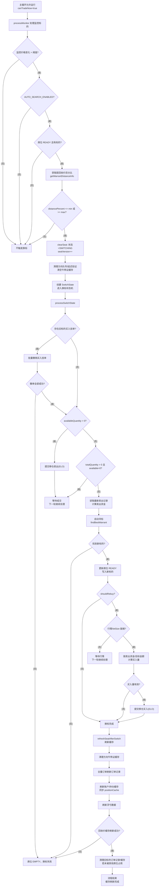

# 自动换标流程图（阈值触发 → 缓存刷新完成）

## 范围说明
- 起点：监控标的价格变化触发的换标阈值检查。
- 终点：新标的 `READY` 且换标后的缓存刷新完成（订单/持仓/浮亏/回收价/旧标的缓存清理）。
- 仅覆盖自动寻标开启后的换标路径，不包含启动时的初始寻标。

## 入口条件（程序允许）
- 主循环在 `runtimeGateMode=strict` 时仅在交易日 + 连续交易时段运行；非交易时段直接返回，不进入换标流程。
- `processMonitor` 每次循环处理监控标的，只有监控价格变化超过 `MONITOR.PRICE_CHANGE_THRESHOLD` 才触发换标检查。
- 自动寻标开关 `AUTO_SEARCH_ENABLED_N` 必须开启；席位必须为 `READY` 且已有标的。

## 关键配置
- `SWITCH_DISTANCE_RANGE_BULL_N` / `SWITCH_DISTANCE_RANGE_BEAR_N`：距回收价触发区间，格式 `min,max`，包含边界（`<=min` 或 `>=max` 即触发）。
- `MONITOR.PRICE_CHANGE_THRESHOLD`：监控价变化阈值，低于该值不触发换标检查。

## 关键模块
- `src/services/autoSymbolManager/index.ts`：阈值判断、清席位、换标状态机、移仓处理。
- `src/main/processMonitor/index.ts`：触发换标、清理队列、换标后刷新缓存。
- `src/core/risk/warrantRiskChecker.ts`：距回收价信息获取与回收价刷新。
- `src/core/orderRecorder/index.ts`：订单记录刷新与订单缓存清理。
- `src/main/mainProgram/index.ts`：行情订阅/退订更新与主循环运行门槛。

## 流程图

## 分阶段说明
### 1. 阈值触发与清席位
- `processMonitor` 在监控价变化时触发 `maybeSwitchOnDistance`，先检查自动寻标开关、席位状态与距回收价信息是否可用。
- 距回收价百分比越界（包含等于边界）后，执行 `clearSeat`：席位标记为 `SWITCHING`，并递增 `seatVersion`，用于阻断旧信号。
- 席位从 `READY` 进入非 `READY` 时，立即清理该方向延迟验证与买卖队列，并清空对应牛熊证信息缓存。

### 2. 换标状态机（processSwitchState）
- **撤单**：批量撤销旧标的未完成买入挂单，任一撤单失败即置席位 `EMPTY` 并终止换标。
- **持仓处理**：
  - 若 `availableQuantity > 0`：提交移仓卖出（ELO），等待成交后继续。
  - 若 `totalQuantity > 0` 且 `availableQuantity = 0`：说明仍有卖出挂单未完成，等待下一轮继续。
- **寻标**：通过 `findBestWarrant` 选择新标的，失败则置席位 `EMPTY`。
- **占位**：寻标成功后将席位置为 `READY` 且写入新标的。
- **移仓买入**（可选）：
  - 若旧标的有持仓则 `shouldRebuy=true`，等待新标的行情就绪后按卖出资金（或目标金额）计算买入量。
  - 买入量有效则提交移仓买入（ELO），完成后结束换标状态机。
- `SwitchState` 挂在内存中，状态机在后续循环中反复执行直至完成或失败。

### 3. 换标完成后的缓存刷新
当席位从旧标的切换为新标的且状态为 `READY` 时触发：
- 清空方向牛熊证缓存，防止旧回收价污染。
- 使用全量订单刷新新标的订单记录（不触发 API 再拉取）。
- 刷新账户与持仓缓存，并同步 `positionCache`。
- 重新构建新标的浮亏监控数据。
- 调用行情接口刷新新标的回收价缓存；若失败则席位置空并终止流程。
- 若旧标的未被其他席位占用，清理旧标的订单记录与订单缓存。

### 4. 关联收尾（不阻断主流程）
- 主循环根据席位变化动态订阅新标的行情、退订无持仓/无挂单的旧标的行情。
- 席位版本号的递增会让延迟验证与队列任务在校验时自动失效，避免错下旧标的。
