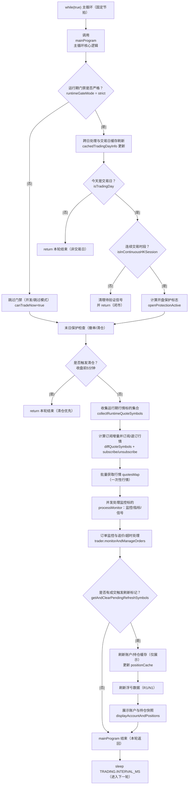
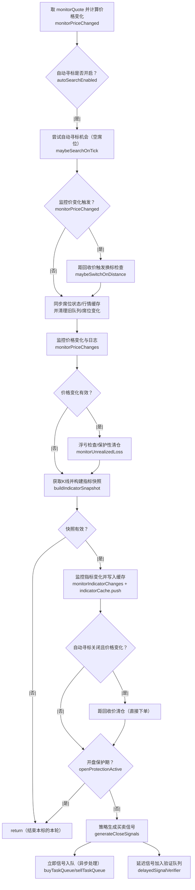
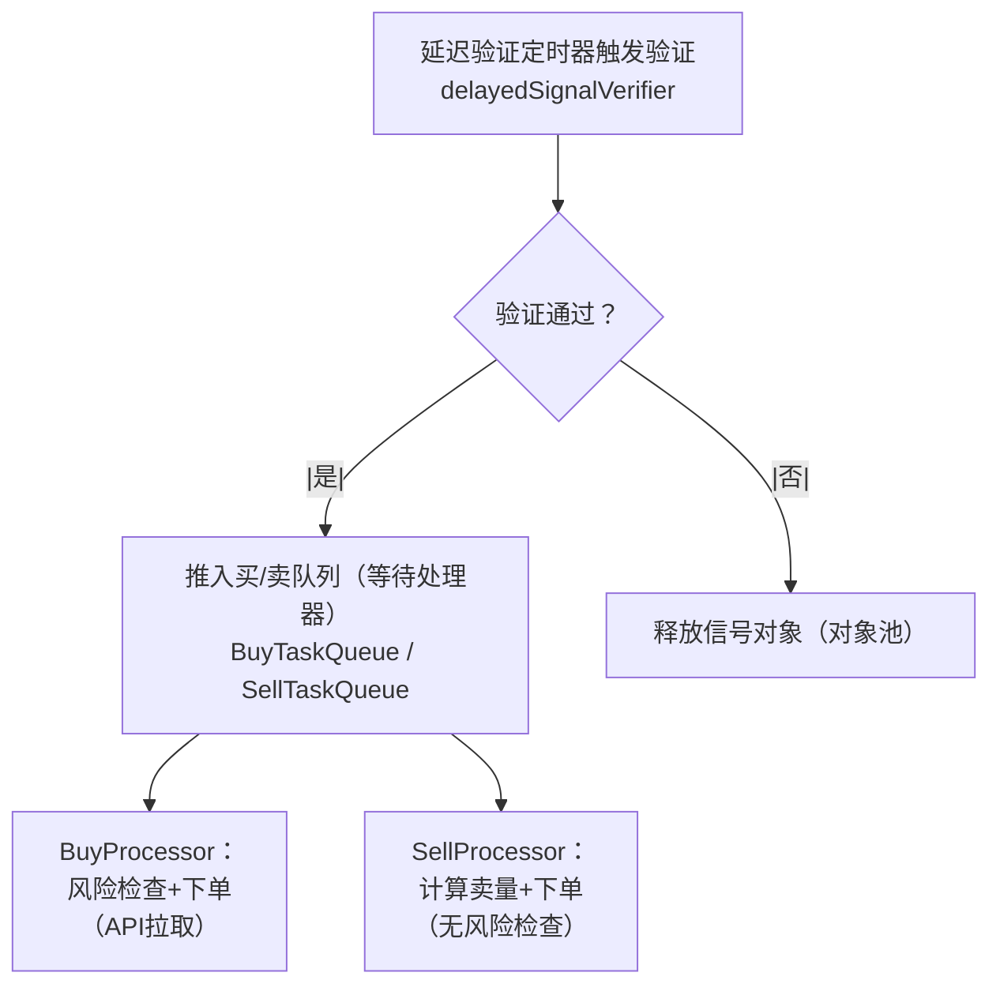

# 主循环流程图（mainProgram 每秒循环）

## 范围说明
- 起点：`src/index.ts` 中的 `while (true)` 每秒调用 `mainProgram(...)`
- 终点：`mainProgram` 本轮返回后 `sleep(TRADING.INTERVAL_MS)`，进入下一轮
- 覆盖：运行期门禁、末日保护、行情订阅与批量行情、并发监控标的处理、订单监控与成交后缓存刷新、与异步买卖处理器的协作
- 不覆盖：启动初始化流程（见 `docs/flow/startup-initialization-flow.md`）、自动换标详细状态机（见 `docs/flow/auto-symbol-switch-flow.md`）

## 运行节拍与前置状态
- 主循环间隔由 `TRADING.INTERVAL_MS` 控制，当前代码是“主循环 + sleep”结构，不使用定时器。
- 进入主循环前，`monitorContexts`、`buy/sell` 处理器、`delayedSignalVerifier` 等已在启动阶段完成初始化并开始运行。

## 关键配置/常量
- `TRADING.INTERVAL_MS`：每次主循环的休眠时间（毫秒）。
- `runtimeGateMode`：运行期门禁模式；`strict` 时严格按交易日/交易时段运行，`skip` 时跳过门禁。
- `tradingConfig.global.openProtection`：开盘保护配置，开启时在开盘后的指定分钟内暂停信号生成。
- `tradingConfig.global.doomsdayProtection`：末日保护开关；收盘前撤单/清仓。
- `MONITOR.PRICE_CHANGE_THRESHOLD`：监控标的价格变化阈值，小于阈值不触发换标检查与部分监控刷新。
- `TRADING.CANDLE_PERIOD` / `TRADING.CANDLE_COUNT`：K线周期与数量，用于指标计算。
- `verificationConfig`：延迟验证配置（买入/卖出延迟时间与验证指标）。

## 主循环总览流程图

## 单监控标的子流程（processMonitor）

## 异步处理器协作（主循环外）

## 分阶段说明
### 1. 循环调度与运行门禁
- 主循环通过 `while(true) + sleep` 以固定节拍运行；每轮调用一次 `mainProgram`。
- `runtimeGateMode=strict` 时，先做跨日处理并刷新交易日信息缓存，然后判断交易日与连续交易时段。
- 当从“连续交易时段”切换到“非连续交易时段”时，会清理所有监控标的的延迟验证队列，避免闭市后继续验证。
- 开盘保护开启时计算 `openProtectionActive`，其结果传递给 `processMonitor` 决定是否跳过信号生成。

### 2. 末日保护（全局优先级最高）
- 末日保护打开时，先尝试在收盘前 15 分钟撤销所有未成交买入单。
- 进入收盘前 5 分钟后触发自动清仓，清仓成功时直接结束本轮主循环，跳过后续行情与信号处理。

### 3. 行情标的收集与批量行情
- 主循环基于监控标的、席位标的、持仓标的和挂单标的汇总出“运行期订阅集合”，统一批量订阅与退订。
- 退订时会保留仍有持仓的标的，避免清掉持仓标的行情。
- 所有行情一次性批量拉取为 `quotesMap`，供本轮 `processMonitor` 和订单监控复用。

### 4. 并发处理每个监控标的（processMonitor）
- 先读取监控标的行情并计算价格变化；价格变化是触发自动换标与部分监控逻辑的关键条件。
- 自动寻标开启时，每轮执行轻量“寻标机会检查”，若价格变化触发换标阈值则进入换标流程，并同步席位与清理旧队列。
- 统一同步席位状态到 `monitorContext`，并刷新做多/做空标的行情缓存供异步处理器使用。
- 仅在价格变化时触发浮亏监控；K线拉取失败会直接结束该监控标的本轮处理。
- 指标快照构建成功后入缓存，用于后续延迟验证；旧快照按对象池规则释放。
- 当自动寻标关闭且价格变化触发距回收价阈值时，直接生成清仓信号并立即下单。
- 开盘保护期间跳过信号生成；否则按策略生成即时/延迟信号并分流到对应队列或验证器。

### 5. 订单监控与成交后缓存刷新
- 监控标的处理完成后，统一执行订单监控（价格跟踪、超时处理等）。
- 若有成交触发刷新标记，主循环统一刷新账户/持仓缓存，并同步 `positionCache`。
- 对成交涉及的标的刷新浮亏数据；最后展示最新账户与持仓快照。

### 6. 异步处理器与延迟验证（与主循环并行）
- `delayedSignalVerifier` 使用定时器在触发时间后进行三点趋势验证，通过则把信号放入买/卖队列。
- `BuyProcessor` 与 `SellProcessor` 使用 `setImmediate` 驱动队列消费，不阻塞主循环；买入包含风险检查，卖出直接计算卖量并下单。

## 模块/函数/变量释义
- **`mainProgram`**：主循环的核心执行函数，负责门禁、末日保护、行情批量获取、并发处理监控标的与订单监控。
- **`processMonitor`**：单监控标的处理函数，完成行情监控、指标计算、信号生成与分流。
- **`runtimeGateMode`**：运行期门禁模式；`strict` 严格按交易日与交易时段运行，`skip` 直接放行。
- **`canTradeNow`**：当前是否允许交易的运行期标志，在 `processMonitor` 中决定是否入队/验证。
- **`openProtectionActive`**：开盘保护期标志，开启时仅允许行情/指标刷新，禁止信号生成。
- **`TRADING.INTERVAL_MS`**：主循环间隔毫秒数。
- **`MONITOR.PRICE_CHANGE_THRESHOLD`**：监控标的价格变化阈值，用于判断是否触发换标与部分检查。
- **`TRADING.CANDLE_PERIOD` / `TRADING.CANDLE_COUNT`**：K线获取参数，影响指标计算窗口。
- **`verificationConfig`**：延迟验证配置（延迟时间与验证指标集合）。
- **`lastState`**：运行期缓存容器，保存账户/持仓、交易日信息、订阅标的集合等状态。
- **`monitorContexts` / `monitorContext`**：每个监控标的的独立上下文，聚合策略、风控、席位、订单记录等依赖。
- **`marketDataClient`**：行情客户端，负责订阅/退订标的并批量获取行情与K线。
- **`trader`**：交易门面，负责订单执行、订单监控、账户与持仓快照读取。
- **`doomsdayProtection`**：末日保护模块，执行收盘前撤单与清仓。
- **`dailyLossTracker`**：日内亏损跟踪器，跨日重置并为浮亏刷新提供偏移数据。
- **`symbolRegistry`**：席位注册表，维护每个监控标的的做多/做空席位状态与版本。
- **`autoSymbolManager`**：自动寻标/换标管理器，按行情变化触发寻标与换标流程。
- **`autoSearchEnabled`**：自动寻标开关，决定是否启用寻标/换标逻辑。
- **`autoSymbolManager.maybeSearchOnTick`**：每轮检查是否需要发起自动寻标（通常针对空席位）。
- **`autoSymbolManager.maybeSwitchOnDistance`**：监控价格变化后检查距回收价阈值，满足条件触发换标流程。
- **`marketMonitor`**：行情与指标变化监控器，用于打印变化日志与触发相关监控动作。
- **`marketMonitor.monitorPriceChanges`**：监控价格变化并更新监控状态，返回是否发生有效变化。
- **`monitorIndicatorChanges`**：监控指标变化并更新监控状态，用于日志/展示。
- **`monitorQuote`**：监控标的当前行情快照，来自本轮 `quotesMap`。
- **`monitorPriceChanged`**：监控标的价格是否发生有效变化的布尔标记。
- **`riskChecker`**：风险检查器，提供回收价距离、浮亏数据刷新等能力。
- **`unrealizedLossMonitor`**：浮亏监控器，监控价格变化时判断是否触发保护性清仓。
- **`unrealizedLossMonitor.monitorUnrealizedLoss`**：执行单标的浮亏检查并在超阈值时触发清仓。
- **`indicatorCache`**：指标环形缓存，保存每秒指标快照供延迟验证读取。
- **`indicatorCache.push`**：将当前指标快照写入缓存。
- **`buildIndicatorSnapshot`**：基于 K 线构建指标快照（RSI/MACD/KDJ/PSY 等）。
- **`strategy.generateCloseSignals`**：多指标策略的信号生成入口，产出即时/延迟信号。
- **`buyTaskQueue` / `sellTaskQueue`**：买/卖任务队列，存放待处理信号。
- **`delayedSignalVerifier`**：延迟验证器，对延迟信号进行趋势验证并回调入队。
- **`BuyProcessor`**：异步买入处理器，执行风险检查与下单，避免阻塞主循环。
- **`SellProcessor`**：异步卖出处理器，计算卖出数量并下单，优先级高于买入。
- **`collectRuntimeQuoteSymbols`**：汇总运行期需要订阅行情的标的集合。
- **`diffQuoteSymbols`**：计算订阅集合的增量变化，用于订阅/退订。
- **`quotesMap`**：本轮批量获取的行情 Map，主循环与 `processMonitor` 复用。
- **`trader.monitorAndManageOrders`**：订单监控入口，处理未成交订单的追价与超时撤单逻辑。
- **`trader.getAndClearPendingRefreshSymbols`**：读取并清空成交后的刷新标记列表。
- **`displayAccountAndPositions`**：展示账户与持仓快照，使用刷新后的缓存输出。
- **`positionCache`**：持仓缓存结构，提供 O(1) 持仓查询供卖出与风控使用。
