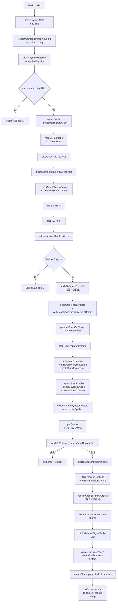

# 启动初始化流程图

## 范围说明

- 起点：`src/index.ts` 中 `main()` 被调用并完成环境加载。
- 终点：完成所有初始化后进入 `while (true)` 主循环，并开始按 `TRADING.INTERVAL_MS` 调度 `mainProgram`。
- 不包含：主循环每秒逻辑（见 `docs/flow/main-loop-flow.md`）、自动换标细节（见 `docs/flow/auto-symbol-switch-flow.md`）。

## 关键输入与运行模式

- `.env.local`：运行时配置来源。
- `RUN_MODE`：决定启动/运行期门禁是否跳过（dev -> skip, prod -> strict）。
- `TRADING.INTERVAL_MS`：启动门禁的轮询间隔，也用于主循环节拍。

## 初始化流程图

## 分阶段说明

### 1. 配置解析与静态校验

- `dotenv.config` 读取 `.env.local` 后，`createMultiMonitorTradingConfig` 解析多监控标的配置，包含监控标的、席位、风控与信号。
- `createSymbolRegistry` 建立席位注册表，记录每个监控标的的做多/做空席位状态与版本号。
- `validateAllConfig` 只做静态校验（参数范围、凭证与格式），失败直接退出。

### 2. 行情客户端与启动门禁

- `createConfig` 生成 LongPort 配置，`createMarketDataClient` 创建行情客户端（仅创建上下文，未订阅）。
- `resolveRunMode` 与 `resolveGatePolicies` 决定门禁模式：dev 跳过、prod 严格。
- `createStartupGate.wait` 在严格模式下循环等待：交易日 + 连续交易时段 + 开盘保护期（早盘或午盘）结束；通过后返回 `startupTradingDayInfo`。

### 3. 交易门面与基础状态

- `createLiquidationCooldownTracker` 初始化保护性清仓冷却追踪。
- `createDailyLossTracker` 构建日内亏损追踪器，用于浮亏偏移与跨日处理。
- `createTrader` 创建交易门面，初始化订单监控与追踪恢复。
- `lastState` 作为运行期缓存容器创建，并初始化 `positionCache`、`monitorStates` 等基础状态。

### 4. 启动期账户/订单与席位占位

- `refreshAccountAndPositions` 读取账户与持仓并写入 `lastState`，必须成功。
- `fetchAllOrdersFromAPI` 拉取历史 + 当日订单失败则降级为空；随后 `seedOrderHoldSymbols` 生成挂单/占用标的集合。
- `dailyLossTracker.initializeFromOrders` 基于订单初始化日内亏损偏移。
- `prepareSeatsOnStartup` 先 `resolveSeatSnapshot` 以历史订单 + 持仓恢复席位，再对启用自动寻标的席位循环 `findBestWarrant` 直至全部 READY，输出 `seatSymbols`。

### 5. 冷却恢复与核心模块

- `tradeLogHydrator.hydrate` 根据当日成交日志恢复保护性清仓冷却。
- 初始化核心模块：`createMarketMonitor`（行情/指标监控）、`createDoomsdayProtection`（收盘前撤单/清仓）、`createSignalProcessor`（信号分流与风险入口）。

### 6. 异步架构与运行期行情订阅

- `createIndicatorCache` 的容量由最大延迟验证时间推导，供延迟验证读取历史指标。
- 创建 `buyTaskQueue` / `sellTaskQueue` 用于异步交易任务。
- `collectRuntimeQuoteSymbols` 汇总监控标的、席位标的、持仓标的与挂单标的。
- 若集合非空则 `subscribeSymbols` 订阅行情，再 `getQuotes` 获取初始化行情缓存 `initQuotesMap`。

### 7. 运行期标的验证与监控上下文

- `validateRuntimeSymbolsFromQuotesMap` 对监控标的与席位标的做必需校验，失败即退出；持仓标的校验只给警告。
- `displayAccountAndPositions` 使用 `initQuotesMap` 输出账户与持仓快照。
- 遍历每个监控标的创建 `monitorContext`：包含 `riskChecker`、`autoSymbolManager`、`strategy`、`unrealizedLossMonitor`、`delayedSignalVerifier` 等。
- `refreshSeatWarrantInfo` 为做多/做空席位初始化回收价等牛熊证信息，用于风险检查。

### 8. 订单记录与浮亏初始化

- 对每个监控标的调用 `orderRecorder.refreshOrdersFromAllOrders`，用全量订单初始化本地订单记录。
- 若配置了 `maxUnrealizedLossPerSymbol`，调用 `riskChecker.refreshUnrealizedLossData` 初始化浮亏基线（使用 `dailyLossTracker.getLossOffset`）。

### 9. 延迟验证回调与处理器启动

- `delayedSignalVerifier.onVerified`：通过后校验席位 READY / 版本一致 / 标的一致，再推入买卖队列；否则释放信号。验证失败时验证器内部记录日志并释放信号。
- 创建并启动 `createBuyProcessor` / `createSellProcessor`，异步消费队列。

### 10. 退出清理与进入主循环

- `createCleanup.registerExitHandlers` 绑定 SIGINT/SIGTERM，停止处理器、销毁验证器并清理缓存。
- 进入 `while (true)` 主循环，按 `TRADING.INTERVAL_MS` 反复调用 `mainProgram`。

## 模块/函数/变量释义（按出现顺序）

- `main`：程序主入口，串行完成所有初始化并进入主循环。
- `dotenv.config`：加载 `.env.local` 到 `process.env`。
- `createMultiMonitorTradingConfig`：解析多监控标的交易配置，生成 `tradingConfig`。
- `tradingConfig`：全局 + 多监控标的配置对象，贯穿策略、风控与自动寻标。
- `createSymbolRegistry` / `symbolRegistry`：席位注册表，维护席位状态与版本号。
- `validateAllConfig`：静态配置校验，失败即退出。
- `createConfig`：构建 LongPort 连接配置。
- `createMarketDataClient` / `marketDataClient`：行情客户端，管理订阅、行情缓存与 K 线获取。
- `resolveRunMode`：解析 `RUN_MODE`，返回 `dev` 或 `prod`。
- `resolveGatePolicies` / `gatePolicies`：将运行模式映射为启动/运行期门禁策略。
- `createStartupGate` / `startupGate.wait`：启动门禁控制器，严格模式下等待交易日/时段/开盘保护通过。
- `startupTradingDayInfo`：启动门禁通过后得到的交易日信息（交易日/半日）。
- `createLiquidationCooldownTracker`：保护性清仓冷却追踪器。
- `createOrderFilteringEngine`：订单过滤引擎，供日内亏损与订单记录使用。
- `createDailyLossTracker` / `dailyLossTracker`：日内亏损跟踪器，支持初始化/跨日重算/浮亏偏移。
- `createTrader` / `trader`：交易门面，封装账户、订单监控、订单执行与订单记录。
- `lastState`：运行期缓存容器，保存账户/持仓/交易日/监控状态/订阅集合等。
- `createPositionCache` / `positionCache`：O(1) 持仓查询缓存。
- `initMonitorState` / `monitorStates`：为每个监控标的建立初始监控状态。
- `refreshAccountAndPositions`：拉取账户与持仓并写入 `lastState`。
- `fetchAllOrdersFromAPI`：拉取历史 + 当日订单，供启动期恢复订单记录。
- `seedOrderHoldSymbols` / `orderHoldSymbols`：从订单中提取挂单/占用标的集合，参与行情订阅。
- `dailyLossTracker.initializeFromOrders`：用全量订单初始化日内亏损基线。
- `prepareSeatsOnStartup`：启动期席位恢复与自动寻标入口。
- `resolveSeatSnapshot`：根据历史订单与持仓推断席位初始标的。
- `findBestWarrant`：自动寻标逻辑，筛选最优牛/熊证。
- `seatSymbols`：启动期席位就绪后的标的快照。
- `createTradeLogHydrator` / `tradeLogHydrator.hydrate`：基于当日成交日志恢复清仓冷却。
- `createMarketMonitor`：行情/指标变化监控器。
- `createDoomsdayProtection`：末日保护模块（撤单/清仓）。
- `createSignalProcessor`：信号处理与风险检查的统一入口。
- `createIndicatorCache` / `indicatorCache`：指标环形缓存，用于延迟验证读取历史指标。
- `createBuyTaskQueue` / `createSellTaskQueue`：买卖任务队列（FIFO）。
- `buyTaskQueue` / `sellTaskQueue`：买卖任务队列实例，供处理器消费。
- `collectRuntimeQuoteSymbols`：汇总运行期需要订阅的所有标的集合。
- `subscribeSymbols`：行情订阅入口。
- `getQuotes` / `initQuotesMap`：批量读取行情缓存，用于初始化名称/价格。
- `validateRuntimeSymbolsFromQuotesMap`：运行期标的校验（必需标的失败即退出）。
- `displayAccountAndPositions`：展示账户与持仓快照（使用行情名称与价格）。
- `monitorContexts`：监控上下文集合，每个监控标的一份。
- `createRiskChecker` / `riskChecker`：风险检查器，包含回收价距离与浮亏刷新能力。
- `createAutoSymbolManager` / `autoSymbolManager`：自动寻标/换标管理器。
- `createHangSengMultiIndicatorStrategy` / `strategy`：多指标策略，生成即时/延迟信号。
- `createUnrealizedLossMonitor` / `unrealizedLossMonitor`：浮亏监控器。
- `createDelayedSignalVerifier` / `delayedSignalVerifier`：延迟信号验证器。
- `createMonitorContext` / `monitorContext`：组装监控标的所需的全部依赖与状态。
- `refreshSeatWarrantInfo`：初始化席位牛熊证回收价等信息，服务风险检查。
- `resolveReadySeatSymbol`：读取 READY 席位的标的代码。
- `orderRecorder`：订单记录器实例，负责拉取与维护本地订单记录。
- `orderRecorder.refreshOrdersFromAllOrders`：用全量订单初始化本地订单记录。
- `riskChecker.refreshUnrealizedLossData`：初始化浮亏监控基线。
- `dailyLossTracker.getLossOffset`：获取日内亏损偏移，参与浮亏计算。
- `delayedSignalVerifier.onVerified`：延迟验证通过时的回调入口。
- `createBuyProcessor` / `createSellProcessor`：异步买卖处理器。
- `createCleanup` / `registerExitHandlers`：退出清理与信号注册。
- `mainProgram`：主循环核心函数，每秒执行一次。
- `sleep` / `TRADING.INTERVAL_MS`：循环节拍与门禁轮询间隔。
