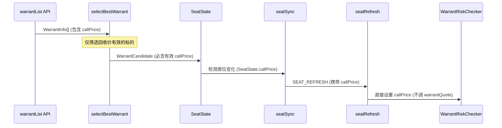

# 从 warrantList 传递 callPrice 消除换标过程对 warrantQuote 的依赖

## 目标与约束

- **寻标筛选**：在寻标筛选过程中直接包含「回收价有效」条件，回收价无效的标的不会被选中，后续逻辑无需再考虑回收价无效。
- **换标过程**：换标过程（含 seatSync → SEAT_REFRESH → seatRefresh）不再使用 warrantQuote API；无/无效 callPrice 时视为刷新失败（markSeatAsEmpty），不兜底调用 `refreshWarrantInfoForSymbol`。
- **启动路径**：通过 warrantList 寻标得到的席位带 callPrice，走 `setWarrantInfoFromCallPrice`；恢复席位/静态配置无 callPrice 时仍可保留 warrantQuote 兜底（仅启动阶段）。

---

## 修改后的数据流

---

## Todos

| id                       | 内容                                                                                                                                                                         | 状态    |
| ------------------------ | ---------------------------------------------------------------------------------------------------------------------------------------------------------------------------- | ------- |
| types-extend             | 扩展类型定义：WarrantListItem/WarrantCandidate 加 callPrice，SeatState 加 callPrice，SeatRefreshTaskData 加 callPrice，WarrantRiskChecker 接口加 setWarrantInfoFromCallPrice | pending |
| filter-callprice         | selectBestWarrant 筛选循环中增加「回收价有效」条件；当选出 best 时携带 callPrice                                                                                             | pending |
| build-seat-callprice     | buildSeatState 支持第五参 callPrice；所有调用点补全                                                                                                                          | pending |
| auto-search-pass         | autoSearch.ts 将 callPrice 从 WarrantCandidate 传入 SeatState                                                                                                                | pending |
| switch-machine-pass      | switchStateMachine 的 findSwitchCandidate 返回 callPrice，SwitchState 存 nextCallPrice，COMPLETE 时写入 SeatState                                                            | pending |
| set-warrant-info         | warrantRiskChecker 新增 setWarrantInfoFromCallPrice（直接缓存，不调 API）                                                                                                    | pending |
| seat-sync-pass           | seatSync 创建 SEAT_REFRESH 时从 SeatState 读取 callPrice 写入 task data                                                                                                      | pending |
| seat-refresh-no-fallback | seatRefresh 仅用 data.callPrice 调用 setWarrantInfoFromCallPrice；无/无效时 markSeatAsEmpty，不调用 refreshWarrantInfoForSymbol                                              | pending |
| startup-optimize         | startup/seat.ts 和 index.ts：寻标成功传 callPrice，恢复席位 callPrice: null；有 callPrice 走 setWarrantInfoFromCallPrice，无则保留 warrantQuote 兜底（仅启动）               | pending |
| null-sites-update        | 所有 SeatState 创建点补充 callPrice: null（createSeatState、markSeatAsEmpty 等）                                                                                             | pending |

---

## 涉及修改的文件

### 第一层：类型与接口扩展（7 处）

**1. [src/services/autoSymbolFinder/types.ts](src/services/autoSymbolFinder/types.ts)**

- `WarrantListItem` 新增 `callPrice?: DecimalLike | number | string | null | undefined`（与 SDK `WarrantInfo.callPrice` 对齐）
- `WarrantCandidate` 新增 `callPrice: number`（寻标筛选已保证有效，非 null）

**2. [src/types/index.ts](src/types/index.ts)**

- `SeatState` 新增可选字段 `callPrice?: number | null`

**3. [src/main/asyncProgram/monitorTaskProcessor/types.ts](src/main/asyncProgram/monitorTaskProcessor/types.ts)**

- `SeatRefreshTaskData` 新增 `callPrice?: number | null`

**4. [src/core/risk/types.ts](src/core/risk/types.ts)**

- `WarrantRiskChecker` 接口新增 `setWarrantInfoFromCallPrice(symbol, callPrice, isLongSymbol, symbolName?)`，返回 `WarrantRefreshResult`

**5. [src/types/index.ts](src/types/index.ts)**（同上文件）

- `RiskChecker` 门面新增 `setWarrantInfoFromCallPrice` 方法签名

**6. [src/core/risk/index.ts](src/core/risk/index.ts)**

- 门面实现中新增 `setWarrantInfoFromCallPrice`，委托给 `warrantRiskChecker.setWarrantInfoFromCallPrice`

**7. [src/services/autoSymbolManager/types.ts](src/services/autoSymbolManager/types.ts)**

- `SwitchState` 新增 `nextCallPrice: number | null`
- `SeatStateBuilder` 签名改为五参：`(symbol, status, lastSwitchAt, lastSearchAt, callPrice?) => SeatState`

### 第二层：数据提取与传递（4 个文件）

**8. [src/services/autoSymbolFinder/utils.ts](src/services/autoSymbolFinder/utils.ts)**

- `WarrantListItem` 需能访问 `callPrice`（类型已扩展），SDK 返回 `Decimal`，用 `decimalToNumber` 转换。
- **selectBestWarrant**：
  - 在循环内增加「回收价有效」筛选：`callPriceNum = decimalToNumber(warrant.callPrice)`，若 `callPriceNum == null || !Number.isFinite(callPriceNum) || callPriceNum <= 0` 则 **continue**，不参与最优比较。
  - 与 `bestSymbol` 一起维护 `bestCallPrice`；当选出最优标的时，从当前 warrant 取有效 callPrice 写入 `WarrantCandidate.callPrice`（选中者必为有效值）。

**9. [src/services/autoSymbolManager/seatStateManager.ts](src/services/autoSymbolManager/seatStateManager.ts)**

- `buildSeatState(symbol, status, lastSwitchAt, lastSearchAt, callPrice?)`：第五参默认 `undefined`；返回对象增加 `callPrice: callPrice ?? null`。
- `clearSeat` 内 `switchStates.set(direction, { ... })` 增加 `nextCallPrice: null`。

**10. [src/services/autoSymbolManager/autoSearch.ts](src/services/autoSymbolManager/autoSearch.ts)**

- `maybeSearchOnTick`：成功时 `buildSeatState(best.symbol, 'READY', nowMs, nowMs, best.callPrice)`（best 已保证有效）；失败/EMPTY/SEARCHING 的 `buildSeatState` 第五参 `null`。

**11. [src/services/autoSymbolManager/switchStateMachine.ts](src/services/autoSymbolManager/switchStateMachine.ts)**

- `findSwitchCandidate` 返回 `Promise<{ symbol: string; callPrice: number | null } | null>`，实现 `return best ? { symbol: best.symbol, callPrice: best.callPrice } : null`（best 来自 selectBestWarrant，callPrice 有效时可传 number）。
- `processSwitchState` 中所有 `buildSeatState` 调用补全第五参（EMPTY/失败/SWITCHING 用 `null`，COMPLETE 用 `state.nextCallPrice ?? null`）。
- `maybeSwitchOnDistance` 中 `switchStates.set(direction, { ... nextCallPrice: next?.callPrice ?? null })`。

### 第三层：消费与缓存（3 个文件）

**12. [src/main/processMonitor/seatSync.ts](src/main/processMonitor/seatSync.ts)**

- 调度 `SEAT_REFRESH` 时 task data 增加 `callPrice: longSeatState.callPrice ?? null` / `callPrice: shortSeatState.callPrice ?? null`。

**13. [src/core/risk/warrantRiskChecker.ts](src/core/risk/warrantRiskChecker.ts)**

- 新增 `setWarrantInfoFromCallPrice(symbol, callPrice, isLongSymbol, symbolName?)`（同步）：callPrice 无效返回 error；否则构造 WarrantInfo 写入缓存，返回 `{ status: 'ok', isWarrant: true }`，不调用任何 API。

**14. [src/main/asyncProgram/monitorTaskProcessor/handlers/seatRefresh.ts](src/main/asyncProgram/monitorTaskProcessor/handlers/seatRefresh.ts)**

- 若 `data.callPrice != null && Number.isFinite(data.callPrice) && data.callPrice > 0`：调用 `context.riskChecker.setWarrantInfoFromCallPrice(...)`，按返回 status 处理（error 时 markSeatAsEmpty），**不调用** `refreshWarrantInfoForSymbol`。
- **否则（无 callPrice 或无效）**：**不调用** `refreshWarrantInfoForSymbol`；直接 `markSeatAsEmpty(..., '未提供有效回收价(callPrice)，无法刷新牛熊证信息', context)`，然后 return。
- `markSeatAsEmpty` 内 `nextState` 增加 `callPrice: null`。

### 第四层：启动路径（2 个文件）

**15. [src/main/startup/seat.ts](src/main/startup/seat.ts)**

- `searchSeatSymbol`：成功寻标时 `updateSeatState(..., { symbol: best.symbol, status: 'READY', lastSwitchAt, lastSearchAt, callPrice: best.callPrice })`；失败时 `callPrice: null`。`updateSeatOnStartup` 传入对象统一加 `callPrice: null`。

**16. [src/index.ts](src/index.ts)**

- 调用 `refreshSeatWarrantInfo` 前从 symbolRegistry 取得 longSeatState/shortSeatState。
- `refreshSeatWarrantInfo(symbol, isLongSymbol, callPriceFromSeat?)`：若 callPriceFromSeat 有效则 `setWarrantInfoFromCallPrice` 并 return；否则保持原有 `refreshWarrantInfoForSymbol` 调用（仅启动恢复/静态兜底）。
- 调用处传入 `longSeatState?.callPrice ?? null` / `shortSeatState?.callPrice ?? null`。

### SeatState / buildSeatState 调用点（第五参 callPrice）

| 文件                  | 场景                               | 第五参                                             |
| --------------------- | ---------------------------------- | -------------------------------------------------- |
| seatStateManager.ts   | buildSeatState 实现                | 形参 callPrice?，返回 callPrice: callPrice ?? null |
| seatStateManager.ts   | clearSeat 内 SWITCHING             | null                                               |
| utils.ts              | createSeatState 返回对象           | callPrice: null                                    |
| autoSearch.ts         | SEARCHING / EMPTY                  | null                                               |
| autoSearch.ts         | READY（best）                      | best.callPrice                                     |
| switchStateMachine.ts | EMPTY / SWITCHING / 失败           | null                                               |
| switchStateMachine.ts | COMPLETE READY                     | state.nextCallPrice ?? null                        |
| seatRefresh.ts        | markSeatAsEmpty nextState          | callPrice: null                                    |
| seat.ts               | 寻标成功/失败、updateSeatOnStartup | best.callPrice / null                              |

---

## 链路逻辑自检

- **自动寻标**：selectBestWarrant 仅选出回收价有效的标的 → WarrantCandidate 必含有效 callPrice → buildSeatState(READY, best.callPrice) → syncSeatState 调度 SEAT_REFRESH → seatRefresh 用 data.callPrice 调用 setWarrantInfoFromCallPrice，**不调 warrantQuote**。
- **自动换标**：findSwitchCandidate 返回的 best 带有效 callPrice → nextCallPrice → COMPLETE 时写入 SeatState → SEAT_REFRESH 带 callPrice → seatRefresh 仅 setWarrantInfoFromCallPrice，**不调 warrantQuote**。
- **启动寻标**：findBestWarrant 得到带有效 callPrice 的 best → updateSeatState(..., callPrice: best.callPrice) → refreshSeatWarrantInfo(..., callPrice) 走 setWarrantInfoFromCallPrice。
- **启动恢复/静态**：无 callPrice → refreshSeatWarrantInfo(..., null) 走 refreshWarrantInfoForSymbol 兜底（仅启动路径）。

---

## 关键设计决策

1. **寻标筛选包含「回收价有效」**：在 selectBestWarrant 循环中过滤掉 callPrice 无效的 warrant，被选中的标的一定带有效 callPrice，后续无需再判断无效。
2. **换标过程不使用 warrantQuote**：seatRefresh 仅通过 data.callPrice 调用 setWarrantInfoFromCallPrice；无/无效 callPrice 时 markSeatAsEmpty，不兜底 refreshWarrantInfoForSymbol。
3. **callPrice 存于 SeatState**：与席位生命周期绑定，清空席位时自然为 null。
4. **启动恢复/静态可保留 warrantQuote 兜底**：仅限启动阶段无 warrantList 来源的席位。
5. **setWarrantInfoFromCallPrice** 通过 isLongSymbol 推断 warrantType：做多=BULL，做空=BEAR。

---

## 参考

- 需求符合性分析：[warrantlist-callprice-passthrough-requirement-analysis.md](warrantlist-callprice-passthrough-requirement-analysis.md)
