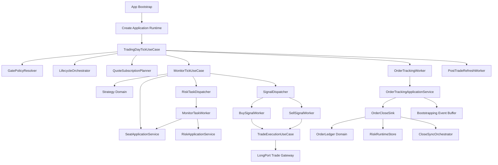
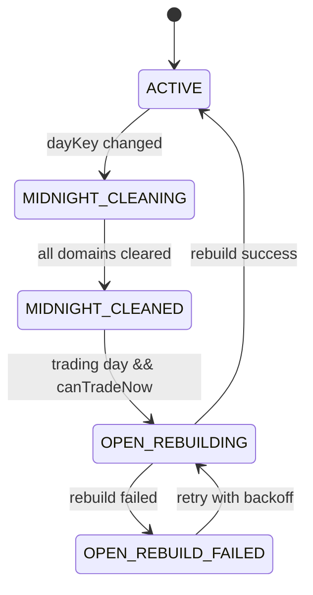

# 港股量化交易系统全系统架构重设计方案

## 1. 文档目的

本文档用于指导当前代码库的全系统架构重构，目标是将现有基于 LongPort OpenAPI 的港股双向量化交易系统，从“可运行但边界松散的工程实现”重构为“业务边界清晰、依赖方向稳定、生命周期可控、可持续演进”的架构。

本文档为二次全链路校验后的修订版，已补齐门禁模型、门禁 owner 与解析时序、风险运行态完整状态模型、订单恢复与事件回放、席位刷新原子顺序、Seat 单写者不变量与分阶段迁移边界等一级架构约束。

本文档不是补丁式修复计划，也不是局部模块整理建议，而是完整目标架构与分阶段落地蓝图。

适用范围：

1. `src/index.ts`
2. `src/main/*`
3. `src/core/*`
4. `src/services/*`
5. `src/config/*`
6. `src/types/*`
7. 与上述模块紧密耦合的 `src/utils/*`

技术边界：

1. 继续使用 TypeScript + Bun + ESM。
2. 继续对接 LongPort OpenAPI。
3. 不改变交易业务语义。
4. 不引入长期并存的双轨兼容架构。

---

## 2. 业务语义对齐

本次架构重构必须严格保持以下业务语义不变。以下术语与流程以 `core-program-business-logic` skill 为准。

### 2.1 系统总体运行模型

系统采用“主循环 + 异步处理器 + 生命周期状态机”。

1. 主循环每秒执行一次。
2. 买入、卖出、监控任务、盯单、成交后刷新为独立异步处理器。
3. 生命周期管理器负责跨日清理与开盘重建。
4. 生命周期交易门禁关闭时，所有下单路径必须停止。
5. 必须显式区分三类门禁：
   - 生命周期执行门禁（execution gate）：关闭时禁止所有新下单路径。
   - 连续交易时段门禁（continuous session gate）：关闭时停止 monitor 主处理，但生命周期与冷却同步仍可推进。
   - 信号生成门禁（signal generation gate）：开盘保护期内仅暂停信号生成，不阻断自动寻标、自动换标、浮亏监控和席位刷新。

### 2.2 信号生成与延迟验证

必须保持以下口径：

1. 信号类型仍为 `BUYCALL / SELLCALL / BUYPUT / SELLPUT`。
2. 卖出信号仅在该方向该标的存在买入订单记录时生成。
3. 延迟验证仍使用“三点验证”语义：
   - 初始触发时刻
   - 五秒后
   - 十秒后
4. 趋势判断口径保持不变，包括 ADX 的特殊方向映射逻辑。
5. 信号入队前仍需完成席位 READY、席位版本、席位标的一致性与行情可用性校验。
6. 实际验证执行时点仍为 `triggerTime + 10 秒`，而不是在 5 秒时立即验证。
7. 指标历史读取仍允许时间容差 `±5 秒`。
8. 延迟验证信号仍按稳定信号标识去重，重复信号不得进入并行验证。
9. 离开连续交易时段时，仍需清理该 monitor 的待验证信号。
10. 验证失败或取消时仍由延迟验证器负责释放信号对象；验证通过后由下游执行链路负责释放。
11. 信号条件求值模型保持不变：条件组间关系为 OR，组内支持"最少满足 N 项"语义；未配置时等价于组内全满足。支持固定指标与带周期指标，以及无方向性趋势强度指标（如 ADX）。

### 2.3 买卖分流与执行链路

必须保持以下口径：

1. 买入与卖出必须继续分流到独立异步处理器。
2. 买入链路固定按以下顺序执行：
   - 风险检查冷却
   - 批量账户/持仓获取
   - 买入频率限制
   - 清仓冷却检查
   - 买入尝试登记
   - 买入价格限制
   - 末日保护拒买
   - 牛熊证风险检查
   - 基础风控
3. 卖出链路不走买入风控流水线。
4. 智能平仓三阶段语义保持不变。
5. 委托价仍使用执行时行情，而不是信号生成快照价。
6. 买入数量优先级保持不变：显式下单数量优先；未显式提供时按目标金额换算并按手数向下取整。
7. 超时策略保持不变：买单超时只撤单不转市价；卖单超时撤单后转市价提交剩余数量。
8. 末日保护时间窗口保持不变：正常交易日 `15:45-16:00` 拒买、`15:55-16:00` 清仓；半日交易日 `11:45-12:00` 拒买、`11:55-12:00` 清仓，且末日清仓不走智能平仓。
9. 末日保护在收盘前 15 分钟的“撤销未成交买单”仍保持“当日首次进入窗口只执行一次”的语义，不得退化为窗口内每轮重复扫描。
10. 末日保护在收盘前 5 分钟执行清仓后，仍需在同一显式链路内完成账户/持仓缓存失效、`positionCache` 清空与相关订单记录清空，不得把这些收口动作散落到后续隐式副作用里。

### 2.4 订单记录与风控

必须保持以下口径：

1. 订单记录仍是智能平仓与浮亏监控的核心数据源。
2. 买卖过滤仍保持“卖单按时间顺序处理、低价优先、整单扣减、不拆单”。
3. 待成交卖出占用防重语义保持不变。
4. 浮亏监控、牛熊证风险、保护性清仓、买入冷却、日内已实现亏损偏移规则保持不变。
5. 日内亏损偏移仍按 `monitorSymbol + direction` 维度维护，并保留“分段起始时间”语义。
6. 保护性清仓冷却仍包含：触发计数、冷却激活、冷却过期扫描、午夜清理、启动日志恢复五部分，不允许退化为单一时间戳缓存。
7. 静态标的距回收价清仓语义保持不变：自动寻标开启时，不再单独运行该监控链路；自动寻标关闭时，仍保留按距回收价阈值触发保护性清仓、并在执行成功后清空订单记录与刷新浮亏/牛熊证缓存的完整流程。

### 2.5 生命周期与自动寻标/换标

必须保持以下口径：

1. 生命周期状态流转仍为：
   - `ACTIVE`
   - `MIDNIGHT_CLEANING`
   - `MIDNIGHT_CLEANED`
   - `OPEN_REBUILDING`
   - `OPEN_REBUILD_FAILED`
2. 开盘重建成功前不得放行交易。
3. 席位状态仍为：
   - `EMPTY`
   - `SEARCHING`
   - `SWITCHING`
   - `READY`
4. 席位版本号仍是阻断旧信号、旧任务、旧换标动作的一致性机制。
5. 自动寻标、距离换标、周期换标的业务条件与优先级保持不变。
6. 启动空席位补席、运行中 `EMPTY` 补席、距离换标预寻标必须共用同一候选筛选口径。
7. 距离换标若候选与当前标的一致，只记录同标抑制并停止本次换标；若周期换标已处于等待空仓状态，该等待状态必须保留。
8. 距离换标若旧标的总持仓大于零但可用持仓为零，状态机必须保持等待，不得提前完成换标。
9. 距离换标仅在存在真实卖出实绩时才按卖出金额回补；移仓卖出与回补买入均继续使用 `ELO`。
10. 周期换标到期后若仍有买单记录，必须进入等待空仓状态；周期换标仅做替换，不做移仓卖出与回补。
11. 启动时对空席位的一次非阻塞寻标尝试，若因早盘延迟窗口跳过，本次仅跳过且不增加失败次数，也不参与冻结判断；该规则在阶段 0 必须写成回归测试，后续阶段不得再隐式改变。
12. 启动席位恢复仍区分两种模式：自动寻标关闭时使用静态长短标的；自动寻标开启时仅恢复有持仓支撑的历史归属标的，空方向保留 `EMPTY` 并等待后续寻标。该规则不得在重构中被统一为单一恢复策略。

### 2.6 订单恢复与事件回放

必须保持以下口径：

1. 订单监控运行态仍区分 `BOOTSTRAPPING` 与 `ACTIVE`。
2. 启动或开盘重建阶段，订单恢复仍基于调用方提供的全量订单快照执行，不引入额外的隐式查询路径。
3. `BOOTSTRAPPING` 阶段收到的订单推送，仍按 `orderId` 缓存最新事件，并在恢复完成后按 `updatedAt` 顺序回放。
4. 卖单若无法解析归属或与当前席位不匹配，仍应直接阻断恢复。
5. 买单若不匹配当前席位，仍应先撤单；撤单失败或撤单结果未知时，仍应阻断恢复。
6. 恢复完成后，仍需执行 tracked orders、pending sell 占用、replayed events 三方一致性对账。
7. 恢复期间产生的 `closeSyncQueue` 任务仍允许在切回 `ACTIVE` 后继续消费；`BOOTSTRAPPING -> ACTIVE` 的切换门槛是“严格恢复 + 必要对账完成”，而不是要求 `closeSyncQueue` 先被清空。

### 2.7 启动与开盘重建的模式差异

必须保持以下口径：

1. 启动初始化与开盘重建共享“快照加载 + 语义重建”骨架，但不是同一个无差别入口。
2. 启动快照加载允许在非交易日执行；开盘重建必须要求当前为有效交易日。
3. 启动链路仍需执行 trade log hydrate，并把 `segmentStartByDirection` 传入日内亏损回算；开盘重建不重复执行该恢复。
4. 开盘重建仍需强制刷新全量订单并重置运行时订阅；启动链路不要求等价选项。
5. 上述差异必须通过显式参数矩阵或独立 use case 表达，禁止把差异隐藏在内部条件分支中。
6. 交易日历预热仍属于 rebuild 阶段的语义重建步骤，不得重新前移到纯 snapshot load 阶段。
7. 启动链路仍需在真正加载 startup snapshot 之前执行 `startup gate`：按运行模式决定是否等待交易日、连续交易时段与开盘保护条件满足后再继续启动。
8. 启动链路仍需在 startup snapshot 成功后执行运行时标的校验，且必须冻结当前 required/warning 矩阵：
   - monitor symbols 始终为 required；
   - ready seat symbols 仅在对应 monitor `autoSearchEnabled=false` 时为 required；
   - `cachedPositions` 中的持仓标的始终为 warning-only；
   - 若 startup snapshot 本身失败并转入后续 lifecycle rebuild，则允许跳过本轮校验并等待重建恢复。
9. `startupGate=strict` 的错误策略必须保持当前实现语义：交易日信息解析失败时按“非交易日”处理并继续等待重试，不得改成 fail-fast 或静默放行。
10. 启动与开盘重建链路中的时间源必须统一使用调用方显式传入的 `now`/`currentTime`，不得在内部重新调用 `new Date()` 形成第二时间真相源，尤其不得影响 startup seat search、open delay 与 rebuild 边界判定。
11. startup/open rebuild 的 snapshot load 阶段必须先基于 `allOrders` 重建 `order hold registry`，再进行运行时订阅规划与行情校验；不得把该前置步骤遗漏到订阅之后。
12. 当前实现中的运行模式语义仍需保留并显式化：`RunMode=prod` 时 `startupGate=strict` 且 `runtimeGate=strict`；`RunMode=dev` 时 `startupGate=skip` 且 `runtimeGate=skip`，不得在重构中把该矩阵隐式折叠为单一默认行为。
13. 交易日历预热口径保持不变：需求窗口仍按当前持仓买单的最早成交时间推导；无持仓时使用回退窗口；向前看固定前瞻天数；超出交易日接口最大回看天数时仍应直接抛错阻断重建，不得静默截断或降级。补齐策略仍优先按自然月分块批量查询，接口不可用时按天回退。

结论：

本次重构只改变架构组织方式、状态归属方式、依赖方向和模块边界，不改变上述业务定义。

---

## 3. 现状中已合理、应保留的部分

当前实现并非需要推倒重来，以下设计方向是合理的，应在目标架构中保留并强化。

### 3.1 异步执行模型是正确的

当前买入、卖出、监控任务、订单监控、成交后刷新已经拆为独立异步组件。对于量化交易系统，这是正确方向，因为：

1. 卖出不应被买入风控阻塞。
2. 风控监控不应被订单监控阻塞。
3. 成交后刷新需要独立调度与门禁。

### 3.2 生命周期框架方向是正确的

当前 `DayLifecycleManager + CacheDomain` 已经具备统一治理跨日状态的雏形。这是值得保留的基础，因为它天然适合：

1. 统一午夜清理。
2. 统一开盘重建。
3. 统一交易门禁。

### 3.3 业务口径沉淀较完整

当前系统在以下方面业务规则较完整：

1. 延迟验证口径明确。
2. 买入风控顺序清晰。
3. 智能平仓语义清晰。
4. 订单记录过滤规则清晰。
5. 自动寻标与换标的约束较完整。
6. 生命周期与启动重建的业务含义已明确。

这意味着本次重构的核心不是“重新定义交易系统”，而是“让已有业务系统获得清晰架构外壳”。

---

## 4. 现状问题归纳

## 4.1 功能模块职责混乱

### 现状

多个模块同时承担“状态保存 + 业务逻辑 + 外部服务调用 + 编排控制”四种职责。

典型问题：

1. `src/index.ts` 同时承担：
   - 配置加载
   - 依赖装配
   - 启动门禁
   - 快照加载
   - 状态初始化
   - 监控上下文构建
   - 生命周期注册
   - 异步处理器注册
   - 延迟验证回调装配
   - 主循环启动
2. `MonitorContext` 同时承担：
   - 配置容器
   - 依赖容器
   - 席位快照缓存
   - 行情缓存
   - 名称缓存
   - 运行时状态读写入口
3. `main/processMonitor/*` 同时承担：
   - 单标的实时计算
   - 状态同步
   - 任务调度
   - 队列入队
   - 风控任务调度
4. `services/autoSymbolManager/*` 既承担领域状态机，又直接调用交易器、订单记录器、行情客户端和风险检查器。

### 问题本质

当前模块边界不是按“业务能力”切分，而是按“实现阶段”逐渐堆叠形成。

### 结果

1. 单个模块体积偏大。
2. 依赖注入对象过大。
3. 状态写入点过多。
4. 修改任何主流程都要理解大量无关上下文。

## 4.2 目录结构与分层语义不一致

### 现状

当前目录：

1. `core/` 中既有纯业务规则，也有对外部服务高度耦合的门面。
2. `services/` 中既有基础设施适配器，也有核心业务流程组件。
3. `main/` 中既有主流程编排，也有大量业务态写入与状态重建逻辑。
4. `types/` 中混入大量上下文契约，并反向依赖 `core`。

### 问题本质

目录名和实际职责不匹配：

1. `core` 不纯。
2. `services` 不只是 service。
3. `main` 不只是 orchestration。
4. `types` 不是稳定底层，而是被上层业务反向污染。

### 结果

1. 新代码没有稳定放置规则。
2. 目录不能表达依赖方向。
3. 团队协作时容易继续把状态和逻辑塞到任意层。

## 4.3 依赖方向错误与循环依赖

### 现状

已识别的典型问题：

1. `types/services.ts` 反向依赖 `core/trader/types.ts`。
2. `core/trader/types.ts` 依赖 `core/riskController/types.ts`。
3. `core/riskController/types.ts` 依赖 `core/orderRecorder/types.ts`。
4. `core/orderRecorder/types.ts` 再依赖 `types/services.ts`。

形成实际循环：

`types/services.ts -> core/trader/types.ts -> core/riskController/types.ts -> core/orderRecorder/types.ts -> types/services.ts`

其他反向依赖：

1. `services/monitorContext/types.ts` 依赖 `core/strategy/types.ts`、`core/riskController/types.ts`、`main/asyncProgram/delayedSignalVerifier/types.ts`。
2. `services/cleanup/types.ts` 依赖 `main/asyncProgram/*`。
3. `services/liquidationCooldown/tradeLogHydrator.ts` 依赖 `core/trader/types.ts` 和 `core/trader/utils.ts`。
4. `services/autoSymbolManager/switchStateMachine.ts` 依赖 `core/trader/utils.ts`。

### 问题本质

当前“契约定义层”没有独立出来，导致接口定义和实现细节互相引用。

### 结果

1. 类型边界不稳定。
2. 模块无法独立演进。
3. 重构时牵一发动全身。
4. 很难建立真正的分层依赖检查。

## 4.4 状态与生命周期归属不清

### 现状

当前最典型的状态容器有：

1. `LastState`
2. `MonitorContext`
3. `SymbolRegistry`
4. `RefreshGate`
5. `CacheDomain` 各域内部 map/cache

问题在于这些状态的“所有者”不明确。

#### `LastState`

`LastState` 同时保存：

1. 交易门禁状态
2. 交易日信息
3. 生命周期状态
4. 账户与持仓缓存
5. 交易日历快照
6. 监控标的状态
7. 运行中订阅集合

这实际上把系统运行态、读模型缓存、生命周期控制、监控状态全部聚合成一个超大对象。

#### `MonitorContext`

`MonitorContext` 在创建后仍持续被写入：

1. `seatState`
2. `seatVersion`
3. `longQuote`
4. `shortQuote`
5. `monitorQuote`
6. `longSymbolName`
7. `shortSymbolName`
8. `monitorSymbolName`

这使它不再是“上下文对象”，而是“可变状态聚合物”。

#### `SymbolRegistry`

`SymbolRegistry` 当前是多写者模型，写入方包括：

1. 启动恢复
2. 自动寻标
3. 自动换标
4. `SEAT_REFRESH` handler
5. 生命周期 seatDomain

这意味着席位版本校验被用于弥补边界不清，而不是作为天然单写者状态模型的附属机制。

### 问题本质

状态没有被拆分为“单一职责 store”。

### 结果

1. 任何模块都可能直接改全局运行态。
2. 生命周期重建需要跨很多模块手工同步。
3. 状态一致性只能靠大量防御性校验维持。

## 4.5 主流程与异步组件之间缺少稳定应用层

### 现状

当前架构里：

1. 主循环直接感知过多依赖。
2. 单标的处理流程直接调度异步任务。
3. 异步 handler 直接触碰 `symbolRegistry`、`dailyLossTracker`、`lastState`、`riskChecker`。
4. `Trader` 是大门面，但其上层仍自己拼装很多运行时上下文。

### 问题本质

缺少独立的 application layer 来承载：

1. 用例编排
2. 任务调度
3. 状态读写协调
4. 领域对象与基础设施之间的翻译

### 结果

1. 主流程编排逻辑散落。
2. worker 之间通过共享状态隐式协作。
3. 很难形成稳定可测试的用例边界。

## 4.6 错误处理、日志和可观测性不一致

### 现状

1. 有的模块直接吞错继续。
2. 有的模块抛错交给上层。
3. 有的模块记录 `warn` 后继续。
4. 有的模块把业务拒绝与异常失败混在一起记录。

### 结果

1. 难以区分“预期业务拒绝”和“真实系统故障”。
2. 重建失败、运行时跳过、任务丢弃、业务拒绝缺少统一分类。
3. 排查线上问题依赖日志经验，而非架构稳定性。

## 4.7 可测试性被大型上下文和共享可变状态削弱

### 现状

当前测试覆盖并不差，但很多测试需要：

1. 构造庞大的上下文对象。
2. 手工拼出共享状态。
3. 用 stub 模拟大量外部依赖。

### 结果

1. 测试成本高。
2. 应用层边界不清，测试容易跨层。
3. 重构时很难只移动一个边界而不牵连大批测试。

---

## 5. 目标架构设计原则

## 5.1 总体原则

1. 业务语义不变，架构边界重做。
2. 核心业务规则与基础设施彻底解耦。
3. 状态必须有唯一 owner。
4. 应用层负责编排，领域层负责业务规则，基础设施负责外部接入。
5. 生命周期必须成为一级架构概念，而不是运行时补丁。
6. 不引入长期双轨兼容路径。

## 5.2 TypeScript 设计原则

目标架构下所有实现代码必须遵循 `typescript-project-specifications` 规范，至少包括：

1. 严格类型安全，禁止 `any`。
2. 以工厂函数替代类式巨型对象。
3. 所有依赖通过参数注入。
4. 类型和实现边界清晰，禁止重复类型和 re-export。
5. 共享类型放在明确的 `types.ts` 单一来源。
6. 工具函数放在明确的 `utils.ts` 单一来源。
7. 完成后必须通过 `bun lint` 与 `bun type-check`。

这条原则不是编码细节，而是架构原则，因为它直接决定模块如何拆分、接口如何定义、依赖如何注入。

## 5.3 状态原则

1. 配置对象只读。
2. 依赖容器只读。
3. 运行时状态单独放入 store。
4. 任何运行时字段只能有一个最终 writer；若同一 store 由多个组件写入，必须是不同字段的非重叠写权限，且文档中要显式列出。
5. 生命周期清理与重建只调用 store 的显式 API，不直接写字段。

## 5.4 依赖原则

1. `core`（domain layer）不依赖 `application`、`infrastructure`。
2. `application` 可以依赖 `core` 与 `application/ports`。
3. `infrastructure` 只实现 `application/ports`，但不主导业务规则。
4. `shared` 只能放真正稳定的基础类型与工具。
5. 禁止新的循环依赖。

## 5.5 运行时一致性原则

1. 门禁必须以结构化 `GatePolicySnapshot` 表达，不允许再用单个布尔值隐式承载多种暂停语义。
2. 订单恢复必须保留严格模式：`BOOTSTRAPPING` 缓存、事件回放、恢复后对账、失败即阻断。
3. 席位刷新必须是固定顺序的原子用例，不允许拆成多个无序副作用函数。
4. 风险运行态必须显式化：日内亏损偏移、分段起点、冷却激活、触发计数、过期扫描不得散落在多个隐式 map 中。
5. 查询型 API 不得隐式改变运行态；冷却过期、恢复回放、重建收口必须由显式用例驱动。
6. 启动初始化与开盘重建必须通过显式 mode matrix 区分，`requireTradingDay / hydrateCooldownFromTradeLog / resetRuntimeSubscriptions / forceOrderRefresh` 不得被合并成隐式默认行为。
7. 交易日历预热必须作为 rebuild 的显式硬步骤，且位于订单账本重建之后、依赖严格交易时段累计的风险/换标逻辑之前。
8. 任何依赖账户/持仓/席位 freshness 的 monitor task，必须先等待 `refreshGate`，再二次校验 seat snapshot；失败即跳过，不得直接消费旧快照。
9. 冷却过期导致的分段切换，必须在同一显式链路内联动刷新受影响方向的浮亏缓存，再允许后续买入风控读取。
10. 分阶段落地允许临时兼容 facade，但 facade 不得自持状态，只能转发到新 store；新旧双写和双真相源仍然禁止。
11. “单写者 service” 不仅表示“只有一个模块能写 store”，还必须提供按聚合键串行化的命令边界。对 `SeatRuntimeStore`，至少要按 `monitorSymbol + direction` 串行执行命令，并在生命周期清理/重建后通过 version 或 lifecycle fence token 拒绝旧命令。
12. 订单关闭语义必须显式化：撤单、改单、WebSocket 终态、恢复对账都要先产出结构化 `CancelOrderOutcome / OrderCloseReason`，再统一进入单一 close sink；不得再用布尔成功/失败、散点 `trackedOrders.delete` 或隐式副作用承载关闭语义。
13. `closeSyncQueue` 是交易执行协议的一部分，不是临时补丁队列；`ALREADY_CLOSED(FILLED/NOT_FOUND)`、终态细节缺失、tracked order miss 等场景必须通过它进入定向对账，并保持按 `orderId` 去重与幂等。
14. 队列与 worker 的新鲜度策略属于业务契约，不是可自由替换的基础设施细节：买卖任务保持 FIFO；monitor task 按 `dedupeKey` 保留最新；order tracking worker 保持 latest-overwrite + single in-flight；延迟验证保持稳定信号去重。
15. 订单归属解析 `stockName + orderOwnershipMapping -> monitorSymbol + direction` 必须有单一 owner，并同时服务 startup seat recovery、严格恢复、订单关闭收口与日内亏损回算；不得在多个上下文中各自实现一套解析逻辑。
16. 对跨多个 store 的“原子 use case”，原子性的定义必须显式化：由单一 application service 在单个命令边界内按聚合键串行执行，先完成必需的重建/刷新/校验，再执行破坏性清理或状态切换；失败时只能落入预先定义的 failure sink 或 safe terminal state，不得留下第二真相源或半完成运行态。
17. `refreshGate`、队列、backoff 等 runtime primitive 可以落在 `infrastructure/runtime`，但其业务真相源、幂等元数据和写入权限必须落在对应 runtime store 与 application service；禁止再次把关键运行态藏回 adapter 私有字段、闭包缓存或 worker 本地变量。
18. `OwnershipResolver` 必须冻结统一优先级：已跟踪订单使用 tracked lifecycle 归属为最高优先级；快照/重建场景以 `stockName + orderOwnershipMapping` 为规范口径；seat symbol 反查只允许作为运行时快捷路径，且不得覆盖 tracked lifecycle。若 seat 反查与 parser 结果冲突，必须进入显式不一致收口，而不是静默二选一。
19. `closeSyncQueue` 达到最大重试后，必须进入显式 safe terminal state：`expectedReason=NOT_FOUND` 时收口为 `NOT_FOUND` 终态；其他原因至少要落入保留告警与可观测 lifecycle 的 failed terminal state，禁止静默删除队列项后丢失状态。
20. 末日保护属于一级运行时协议：收盘前 15 分钟撤单必须具备按交易日幂等的“一次性执行”状态；收盘前 5 分钟清仓后的缓存失效、持仓缓存清空与账本清空必须属于同一显式收口链路。

---

## 6. 目标分层

推荐采用以下五层结构。

## 6.1 Layer 1: `app`

职责：

1. 读取环境变量。
2. 创建 composition root。
3. 注册进程退出钩子。
4. 启动主循环和 worker。

禁止：

1. 实现业务规则。
2. 直接改运行时状态。
3. 直接发起交易决策。

## 6.2 Layer 2: `application`

职责：

1. 表达系统用例。
2. 编排主循环与异步 worker。
3. 协调 store、core domain service、gateway。
4. 做输入输出翻译和任务分发。

核心模块建议：

1. `application/tradingDay`
2. `application/monitor`
3. `application/trade`
4. `application/orderTracking`
5. `application/risk`
6. `application/seat`
7. `application/lifecycle`
8. `application/ports`

## 6.3 Layer 3: `core`（Domain Layer）

职责：

1. 封装纯业务规则。
2. 表达不变量和状态机。
3. 提供与外部无关的领域算法。

核心上下文建议：

1. `core/strategy`
2. `core/signal`
3. `core/seat`
4. `core/trade`
5. `core/orderLedger`
6. `core/risk`
7. `core/tradingCalendar`

## 6.4 Layer 4: `infrastructure`

职责：

1. 对接 LongPort。
2. 对接文件和日志。
3. 提供 runtime primitives。
4. 实现 gateway/adapter。

模块建议：

1. `infrastructure/longport`
2. `infrastructure/persistence`
3. `infrastructure/runtime`
4. `infrastructure/observability`

## 6.5 Layer 5: `shared`

职责：

1. 稳定基础类型。
2. Result / Error code / 基础时间工具。
3. 与业务上下文无关的公共工具。

限制：

1. 不放 trader、risk、monitor 这类业务契约。
2. 不作为“万金油目录”。

---

## 7. 目标核心领域边界

## 7.1 Trading Day Lifecycle Context

职责：

1. 管理交易日状态机。
2. 管理午夜清理与开盘重建。
3. 产出生命周期相关输入：`lifecycleState / pendingRebuild / targetTradingDayKey / lifecycleFenceToken`。
4. 为 Gate Policy Context 提供生命周期侧事实输入，但不直接推导最终 `GatePolicySnapshot`。

它只负责生命周期编排，不负责最终门禁解析，也不负责业务计算。

## 7.2 Monitor Strategy Context

职责：

1. 获取监控标的快照。
2. 计算指标。
3. 生成立即信号与延迟验证信号。
4. 生成监控任务。

它不直接下单，只产生”待执行意图”。

`MonitorScope`（只读输入）：

1. 监控标的配置（`MonitorConfig`）。
2. 已校验的监控标的代码（`normalizedMonitorSymbol`）。
3. 指标画像（`IndicatorUsageProfile`）：启动编译后不可变，描述该标的在运行期需要计算、校验、延迟验证和展示的指标范围。

`MonitorScope` 是 `MonitorTickUseCase` 的不可变输入，替代当前 `MonitorContext` 中的配置与编译产物部分；运行时可变状态由 `MonitorRuntimeStore` 承载。

## 7.3 Seat Context

补充约束：

1. `SeatRefreshUseCase` 虽然由 `SeatApplicationService` 发起和串行化，但它本质上是“跨上下文的 application transaction”，不是 Seat 领域单独拥有的内部状态机。
2. Seat Context 只拥有席位状态、席位工作流、席位失败收口与席位命令边界；订单账本、账户/持仓读模型、浮亏缓存、牛熊证缓存仍分别由各自 context/store 持有。
3. `SeatRefreshUseCase` 对外部状态的写入必须通过显式 application port / use case 完成，禁止把 `SeatApplicationService` 演化成新的胖门面，并直接持有订单账本、账户缓存或风险缓存的内部可变状态。

职责：

1. 管理席位状态、席位版本与席位元数据。
2. 管理 `callPrice / lastSearchAt / lastSeatReadyAt / searchFailCountToday / frozenTradingDayKey` 等席位业务字段。
3. 管理自动寻标、距离换标、周期换标运行态，包括 in-flight switch workflow、同标抑制与周期 pending。
4. 对外提供单写者 seat application service 与固定顺序的 seat refresh use case。
5. 管理席位失败收口：换标或 refresh 失败时原子执行 EMPTY、版本递增、方向队列清理、待验证信号清理、失败计数与冻结状态更新。
6. 提供按 `monitorSymbol + direction` 串行化的命令处理边界，阻断 startup、auto-search、switch、seat refresh、lifecycle clear 并发写冲突。

目标是让席位成为真正独立的领域聚合，而不是 `symbolRegistry + switchStates + suppression + pending` 的分散组合。

不可弱化的业务不变量：

1. 启动空席位补席、运行时空席位补席、距离换标预寻标必须共用同一候选筛选规则与同一降级带语义。
2. 距离换标命中同标的候选时只能写入 suppression，不得提升版本、不得清队列、不得错误清除已有周期 pending。
3. 距离换标若旧标的总持仓大于零但可用持仓为零，必须继续等待，不能直接推进到绑定新标的或完成状态。
4. 距离换标只有在卖出真实成交金额可计算时才允许回补；移仓卖出与回补买入必须继续使用 `ELO`。
5. 周期换标到期后若仍有买单记录，必须进入等待空仓；周期换标只做替换，不做移仓卖出和回补。

## 7.4 Order Ledger Context

职责：

1. 维护买单记录。
2. 维护待成交卖出占用。
3. 提供智能平仓和浮亏所需账本口径。
4. 提供重建算法。
5. 拥有订单归属解析规则：`stockName + orderOwnershipMapping -> monitorSymbol + direction`。
6. 提供 startup seat recovery 与严格恢复所需的“最新成交标的候选提取/过滤”能力。
7. 提供结构化 `OwnershipResolution`，显式区分 `tracked / parser / seat-shortcut / unresolved / conflicted` 等来源与结果，供 close sink、strict recovery、daily loss 与 startup recovery 共用。

统一归属解析优先级：

1. 已跟踪订单或已恢复订单的 lifecycle 归属最高优先级，不得被后续 seat 或 parser 覆盖。
2. startup recovery、strict recovery、daily loss 回算等快照语义场景，以 `stockName + orderOwnershipMapping` 作为规范口径。
3. close sink / close sync 运行时为保持当前实现语义，必须先尝试 seat symbol 反查作为运行时快捷路径，seat 无法解析时才回退到 parser；但若 seat 与 parser 同时存在且结果冲突，必须记录显式冲突日志/指标，禁止静默丢失冲突信息，也不得用 parser 覆盖 tracked lifecycle 或已命中的 seat 快捷路径。

它是订单业务口径，不是 LongPort API adapter。

## 7.5 Trade Execution Context

职责：

1. 执行交易意图。
2. 提交订单。
3. 管理订单监控运行态。
4. 管理 `BOOTSTRAPPING` 事件缓存与回放。
5. 执行严格快照恢复与恢复后对账。
6. 管理在途订单。
7. 管理结构化撤单/改单结果与关闭原因模型。
8. 提供订单关闭的唯一收口函数（close sink），统一处理 `FILLED / CANCELED / REJECTED / NOT_FOUND`。
9. 管理 `closeSyncQueue`、终态幂等与定向对账。
10. 保证超时撤单、超时转市价、WebSocket 终态、恢复对账共享同一关闭语义。
11. 明确 `BOOTSTRAPPING -> ACTIVE` 切换协议：严格恢复、事件回放与必要对账完成后即可切回 `ACTIVE`；恢复期间创建的 `closeSyncQueue` 任务在 `ACTIVE` 中继续消费，不要求以“队列先清零”作为切换前提。
12. 定义 `closeSyncQueue` 重试耗尽后的 safe terminal state，禁止把“最终失败”退化为无状态删除。

`Trader` 当前门面需要拆解到该上下文内部，而不是继续作为全局胖门面。

## 7.6 Risk Control Context

职责：

1. 买入风控流水线。
2. 牛熊证风险。
3. 浮亏监控。
4. 日内亏损偏移与冷却联动。
5. 风险检查冷却（当前 `lastRiskCheckTime`）。
6. 牛熊证信息快照缓存。
7. 浮亏缓存快照。

风险上下文的业务规则留在 `core`（domain layer）；相关运行态由 application 层通过显式 risk runtime store 协调。

## 7.7 Market Data Context

职责：

1. 报价订阅与缓存。
2. K 线订阅与获取。
3. 交易日与交易日历数据查询（数据源适配）。
4. 运行时订阅重置。
5. 维护运行时报价订阅集合（原 `allTradingSymbols`）及其增量规划。
6. 维护 K 线订阅运行态（原 `subscribedCandlesticks`）及其重置。
7. 基于固定输入口径生成订阅目标集合：监控标的、当前席位标的、当前持仓标的、order hold registry 标的。
8. 通过 `MarketDataRuntimeStore` 持有运行时订阅状态，禁止把订阅运行态散落在 `LastState` 或客户端私有字段中。

这属于基础设施上下文，但需要通过清晰 port 暴露给 application。

补充约束：

1. 运行时订阅集合属于行情运行态，不属于账户/持仓读模型。
2. `TradingDayTickUseCase` 只能通过 `QuoteSubscriptionPlanner` 或等价显式 port 读取/更新该集合，禁止散落在主循环各处手工拼接。
3. `subscribedCandlesticks` 与 quote subscription 一样属于行情运行态，由 Market Data Context 唯一 owner 持有，monitor/application 层不得直接管理其内部集合。
4. `runtimeSubscribedSymbols / runtimeSubscribedCandlesticks` 必须由 `MarketDataRuntimeStore` 显式持有；写入只能通过 `QuoteSubscriptionPlanner` 或 `MarketDataApplicationService` 的显式命令 API 完成。
5. 交易日历规则、不变量与状态机口径归 `core/tradingCalendar`；Market Data Context 只负责日历数据读取、缓存与查询适配，不得实现第二套日历规则。

## 7.8 Gate Policy Context

职责：

1. 根据生命周期状态、交易日信息、连续交易时段、开盘保护以及 `runtimeGate` 策略推导最终 `GatePolicySnapshot`。
2. 明确区分“禁止执行”和“禁止信号生成”。
3. 作为唯一门禁解析器，把最终快照写入 `SystemRuntimeStateStore`。
4. 为主循环、monitor tick、worker 执行层提供统一门禁判断口径。

它不是简单的布尔状态，而是运行时行为控制的统一语义源。

固定时序约束：

1. 同一轮 `TradingDayTickUseCase` 中必须先完成 `LifecycleOrchestrator.tick`，再解析最终 `GatePolicySnapshot`。
2. 任意模块都不得把 lifecycle tick 之前的临时交易日/时段判断结果当作最终 gate 使用。
3. `runtimeGate=strict|skip` 的语义只能由 `GatePolicyResolver` 单点消费并体现在最终快照中；下游模块不得自行分支实现第二套运行模式门禁。
4. 下游 use case 只能读取已落库的最终快照，不得自行拼装第二套 execution/session/signal-generation 判定。

阶段迁移约束：

1. 在 `TradingDayTickUseCase` 真正落地前，当前主循环中的门禁计算仍是临时唯一 owner；阶段 1 只能引入 `GatePolicySnapshot` 结构、存储位点和兼容投影接口，不能提前并行引入第二个真实 resolver。
2. `GatePolicyResolver` 成为唯一门禁解析 owner 的切换，必须与 `TradingDayTickUseCase` 收口到同一阶段完成；切换完成后，旧 `mainProgram` 内的交易日/时段/开盘保护最终判定逻辑必须同步删除，禁止双裁决并存。
3. 在过渡阶段，旧字段如 `lastState.canTrade / openProtectionActive / isTradingEnabled` 若仍需对旧模块暴露，只能由同一份最终 `GatePolicySnapshot` 投影生成，不能再各自独立重算。

---

## 8. 目标状态归属设计

当前 `lastState`、`monitorContext`、`symbolRegistry` 需要重构为以下显式状态所有者。

## 8.1 `SystemRuntimeStateStore`

负责：

1. 生命周期状态
2. 当前交易日 key
3. 启动/重建 pending 状态
4. `lifecycleFenceToken`
5. `GatePolicySnapshot`
6. 开盘保护阶段信息
7. 末日保护运行态：至少包含“close-15 撤单已执行的交易日标记”

不负责：

1. 账户缓存
2. 持仓缓存
3. 监控标的状态

写入约束：

1. `LifecycleOrchestrator` 只能写 `lifecycleState / currentDayKey / pendingRebuild / targetTradingDayKey / lifecycleFenceToken`。
2. `GatePolicyResolver` 是唯一允许写入 `GatePolicySnapshot` 的组件。
3. `DoomsdayProtectionUseCase` 只能写末日保护的日内幂等运行态（如 close-15 撤单已执行日标记）。
4. 下游执行链路只能消费“同一轮 lifecycle tick 完成后”落库的最终快照。

## 8.2 `TradingDayReadModelStore`

负责：

1. `cachedAccount`
2. `cachedPositions`
3. `positionCache`
4. `cachedTradingDayInfo`
5. `tradingCalendarSnapshot`

它是读模型缓存层，只承载账户、持仓、交易日与交易日历快照，不承载运行时订阅集合。

## 8.3 `MonitorRuntimeStore`

按 monitor 维度负责：

1. `monitorPrice`
2. `longPrice`
3. `shortPrice`
4. `signal`
5. `pendingDelayedSignals`
6. `monitorValues`
7. `lastMonitorSnapshot`
8. `lastCandleFingerprint`

它取代当前 `LastState.monitorStates` 的散装写法。

## 8.4 `SeatRuntimeStore`

负责：

1. 多空席位状态
2. 席位版本
3. 席位元数据：`callPrice`、`lastSearchAt`、`lastSeatReadyAt`
4. 席位冻结状态与当日失败计数
5. 周期换标 pending 状态
6. 同标抑制状态
7. 进行中换标工作流状态（原 `switchStates`）
8. 串行化命令与生命周期 fence 运行态（例如 in-flight command token、lastLifecycleFenceToken）

关键原则：

1. 只能由 `SeatApplicationService` 写入。
2. 启动恢复、自动寻标、换标、seat refresh、生命周期清理都必须经过同一服务。
3. 若阶段性保留旧 `symbolRegistry` 接口，它只能是该 store 的只读/转发 facade，不得再持有独立状态。
4. 同一席位键的命令必须串行执行；凡是跨过版本边界或生命周期 fence 的旧命令，必须在提交前或落库前被拒绝。

## 8.5 `ExecutionRuntimeStore`

负责：

1. 订单跟踪运行态
2. `BOOTSTRAPPING` 事件缓存
3. `trackedOrderLifecycles`
4. `closedOrderIds` 与关闭幂等元数据
5. `closeSyncQueue`
6. 撤单/改单重试与能力运行态（如 backoff、replace capability）
7. `pendingRefreshSymbols`
8. `refreshGate`
9. `lastBuyThrottle`
10. order hold registry
11. `closeSyncQueue` 耗尽重试后的 failed terminal metadata（用于保留可观测性与终态语义）
12. `closeSyncQueue` 的独立调度/唤醒运行态（不得把消费时机隐式绑死到 quote polling）

目的：

把交易执行链路的运行态从 `Trader` 大门面与全局状态中剥离出来。

## 8.6 `RiskRuntimeStore`

负责：

1. `riskDayKey`
2. 按 `monitorSymbol + direction` 维度维护的日内亏损计算态：`buyOrders / sellOrders / dailyLossOffset`
3. `segmentStartByDirection`
4. 当前周期保护性清仓触发计数
5. 当前激活冷却的起点与结束边界
6. 最近一次已过期冷却边界（用于 startup hydrate 与分段恢复）
7. 冷却过期待消费事件
8. 分段重置幂等元数据（例如 `lastResetByCooldownEndMs`）
9. 风险检查冷却运行态（当前 `lastRiskCheckTime`）
10. 牛熊证信息快照缓存（当前 `longWarrantInfo / shortWarrantInfo`）
11. 浮亏缓存快照（当前 `unrealizedLossData`）

目的：

把 `dailyLossTracker`、`liquidationCooldownTracker`、风险检查冷却、牛熊证缓存与浮亏缓存从“隐式服务内部状态”提升为显式运行时 owner。

补充约束：

1. 同一 `cooldownEndMs` 的冷却过期事件重复消费，不得重复触发 `resetDirectionSegment`。
2. 上述幂等保护必须是 store 持有的显式状态，而不是重新退回 service 私有闭包或局部缓存。
3. `OrderLedger Context` 仍负责全局订单账本；`RiskRuntimeStore` 负责“按交易日 + 分段”切分后的风险计算态，二者不能混成一个 owner。
4. 增量成交记账与全量重算必须落到同一份 `RiskRuntimeStore` 状态模型上，禁止一部分放 store、一部分继续留在 `dailyLossTracker` 私有数组中。
5. 午夜清理、trade log hydrate、冷却过期扫描只能通过显式 `RiskApplicationService` 驱动，不得继续由查询 API 隐式推进。
6. `riskCheck cooldown`、牛熊证缓存、浮亏缓存都必须进入同一份 risk runtime owner；禁止继续留在 `signalProcessor` 或 `riskChecker` 私有闭包里形成第二真相源。

## 8.7 `MarketDataRuntimeStore`

负责：

1. `runtimeSubscribedSymbols`
2. `runtimeSubscribedCandlesticks`
3. 订阅规划幂等元数据（例如 `lastQuotePlanFingerprint` / `lastCandlePlanFingerprint`）

写入约束：

1. 只能由 `QuoteSubscriptionPlanner` 或 `MarketDataApplicationService` 写入。
2. 生命周期清理与开盘重建对订阅运行态的重置，必须通过显式 use case/API 完成，不得由调用方直接改字段。

### 现有状态到目标状态映射

| 现有状态 | 目标 owner |
| --- | --- |
| `lastState.lifecycleState` | `SystemRuntimeStateStore` |
| `lastState.currentDayKey` | `SystemRuntimeStateStore.currentDayKey` |
| `lastState.pendingOpenRebuild` | `SystemRuntimeStateStore.pendingRebuild` |
| `lastState.targetTradingDayKey` | `SystemRuntimeStateStore.targetTradingDayKey` |
| `lastState.isTradingEnabled` | 删除，统一从 `GatePolicySnapshot.executionGate` 投影 |
| `lastState.canTrade` | 删除，统一从 `GatePolicySnapshot.continuousSessionGate` 投影 |
| `lastState.openProtectionActive` | 删除，统一从 `GatePolicySnapshot.signalGenerationGate/openProtectionPhase` 投影 |
| `lastState.isHalfDay` | 删除，统一从 `TradingDayReadModelStore.cachedTradingDayInfo` 投影 |
| `lastState.cachedAccount` | `TradingDayReadModelStore` |
| `lastState.cachedPositions` | `TradingDayReadModelStore` |
| `lastState.tradingCalendarSnapshot` | `TradingDayReadModelStore` |
| `lastState.allTradingSymbols` | `MarketDataRuntimeStore.runtimeSubscribedSymbols` |
| `quoteClient.subscribedCandlesticks` | `MarketDataRuntimeStore.runtimeSubscribedCandlesticks` |
| `lastState.monitorStates` | `MonitorRuntimeStore` |
| `dailyLossTracker` 内部状态 | `RiskRuntimeStore` |
| `liquidationCooldownTracker` 内部状态 | `RiskRuntimeStore` |
| `signalProcessor.lastRiskCheckTime` | `RiskRuntimeStore.riskCheckCooldown` |
| `buyThrottle.lastBuyTime` | `ExecutionRuntimeStore.lastBuyThrottle` |
| `warrantRiskChecker.longWarrantInfo/shortWarrantInfo` | `RiskRuntimeStore.warrantInfoSnapshots` |
| `unrealizedLossChecker.unrealizedLossData` | `RiskRuntimeStore.unrealizedLossSnapshots` |
| `monitorContext.seatState` | 删除，统一从 `SeatRuntimeStore` 查询 |
| `monitorContext.seatVersion` | 删除，统一从 `SeatRuntimeStore` 查询 |
| `SeatState.callPrice / lastSearchAt / lastSeatReadyAt / searchFailCountToday / frozenTradingDayKey` | `SeatRuntimeStore` |
| `autoSymbolManager.switchStates` | `SeatRuntimeStore` |
| `autoSymbolManager.switchSuppressions` | `SeatRuntimeStore` |
| `autoSymbolManager.periodicSwitchPending` | `SeatRuntimeStore` |
| `monitorContext.longQuote/shortQuote/monitorQuote` | 删除可变缓存，改为 `MonitorSnapshot` 或读模型查询 |

结论：

目标态不再保留“大而全”的 `LastState` 和“可变依赖容器型” `MonitorContext`。

---

## 9. 主流程与异步组件的目标划分

## 9.1 启动与开盘重建

不把 startup/open rebuild 合并成一个无差别入口，而是保留两个显式 application use case，并共享同一套 rebuild 语义：

1. `BootstrapStartupRuntimeUseCase`
2. `OpenRebuildRuntimeUseCase`
3. 二者共享 `RebuildTradingDayRuntimeUseCase`

共享 `RebuildTradingDayRuntimeUseCase` 职责：

1. 基于调用方提供的快照重建订单账本。
2. 执行交易日历预热。
3. 重建风控缓存与浮亏缓存。
4. 恢复订单跟踪。
5. 回放 `BOOTSTRAPPING` 阶段订单事件。
6. 执行恢复后对账并切回 `ACTIVE`。

`BootstrapStartupRuntimeUseCase` 职责：

1. 在 startup mode 下先执行 `startup gate`，决定是否等待允许启动的时点。
2. 使用 startup mode 加载运行时快照。
3. 在允许非交易日启动的前提下恢复席位与风险运行态。
4. 对 startup snapshot 执行运行时标的校验；校验矩阵必须显式保持为“monitor required / non-auto-search ready seat required / cached position warning-only”；若 startup snapshot 失败并已切换到后续 lifecycle rebuild，则允许跳过本轮校验。
5. 调用共享 rebuild use case 完成语义重建。

`OpenRebuildRuntimeUseCase` 职责：

1. 使用 rebuild mode 加载运行时快照。
2. 在交易日门禁下执行开盘重建。
3. 调用共享 rebuild use case，并在失败时阻断交易。

显式 mode matrix：

| 选项                          | Startup | Open Rebuild |
| ----------------------------- | ------- | ------------ |
| `requireTradingDay`           | `false` | `true`       |
| `hydrateCooldownFromTradeLog` | `true`  | `false`      |
| `resetRuntimeSubscriptions`   | `false` | `true`       |
| `forceOrderRefresh`           | `false` | `true`       |

显式 run mode -> gate mode matrix：

| `RunMode` | `startupGate` | `runtimeGate` |
| --------- | ------------- | ------------- |
| `prod`    | `strict`      | `strict`      |
| `dev`     | `skip`        | `skip`        |

约束：

1. 以上差异必须显式保留，不得在重构中被“统一默认值”吞掉。
2. `hydrateCooldownFromTradeLog` 只影响 startup path，不得在 open rebuild 中重复回放。
3. 交易日历预热属于共享 rebuild use case，不属于纯快照加载步骤。
4. `startup gate` 与运行时标的校验属于 startup path 的硬步骤，不得隐式并入 open rebuild，也不得在重构中静默删除。
5. `startupGate=strict` 的错误策略必须显式保留为“交易日信息解析失败时按非交易日处理并等待重试”，不得改造成 fail-fast。
6. `loadTradingDayRuntimeSnapshot`、startup seat recovery、startup seat search 与 open rebuild 必须共享调用方传入的统一时间源，不得在内部再生成新的当前时间。
7. 运行时订阅规划与 startup runtime validation 之前，必须先基于 startup/open rebuild 拉取到的 `allOrders` 执行 `order hold registry` 重建。
8. `runtimeGate` 仍属于一级运行时策略输入：`strict` 时按交易日/连续交易时段/开盘保护解析门禁；`skip` 时跳过对应运行时门禁检查，并继续允许主循环按开发模式推进。

## 9.2 每秒主循环

统一为：

`TradingDayTickUseCase`

职责：

1. 读取交易日/时段。
2. 驱动生命周期 tick。
3. 解析并落库最终 `GatePolicySnapshot`。
4. 执行冷却过期同步。
5. 在允许的运行时门禁下执行末日保护检查。
6. 规划订阅集合。
7. 批量获取行情。
8. 在 `continuous session gate=true` 时并发派发 monitor tick。
9. 在允许的运行时门禁下触发订单监控与成交后刷新调度。

关键要求：

1. 同一轮 tick 中必须先完成 lifecycle tick，再解析最终 `GatePolicySnapshot`；任何旧快照都不得跨 tick 复用为最终门禁。
2. 冷却过期同步即使在 `execution gate=false` 或 `continuous session gate=false` 时也必须推进。
3. 若冷却过期同步触发分段切换，则相关 `onSegmentReset` 副作用必须在同一轮 tick 内完成，再允许后续买入风控读取。
4. 订阅集合规划输入必须固定为：monitor symbols + ready seat symbols + cached positions symbols + order hold registry symbols。
5. `order hold registry` 与 `cachedPositions` 不得被视为“实现细节”而从订阅规划中省略。
6. `continuous session gate=false` 时，`TradingDayTickUseCase` 不得派发 `MonitorTickUseCase`，也不得在该轮 tick 中继续执行末日保护检查、订单监控调度或成交后刷新调度；严格保持当前实现语义，仅生命周期 tick 与冷却同步等显式链路继续推进。若存在独立 worker 的在途任务，其收口由各自 worker 生命周期负责，不视为当前 tick 继续放行对应主链路。
7. 收盘前 15 分钟撤单路径必须按交易日幂等：同一交易日首次进入窗口执行一次，后续 tick 不重复扫描。
8. 收盘前 5 分钟清仓成功后，必须在同一显式 use case 中完成账户/持仓缓存失效、`positionCache` 清空与相关订单记录清空，再结束本轮 tick。
9. `closeSyncQueue` 消费与重试推进必须在每轮 tick 中无条件推进，不受 `continuous session gate` 和 `execution gate` 约束；这保证了订单终态对账不会因非交易时段而产生饥饿窗口。

## 9.3 单监控标的处理

统一为：

`MonitorTickUseCase`

职责：

1. 读取 monitor runtime。
2. 读取 seat snapshot。
3. 生成自动寻标/换标任务。
4. 生成风险监控任务。
5. 计算指标快照。
6. 生成立即信号和延迟验证信号。

它只负责“生成意图”，不直接操作底层基础设施。

关键要求：

1. `signal generation gate=false` 时，仍需允许自动寻标、换标、风险任务和指标快照推进。
2. `continuous session gate=false` 时，`MonitorTickUseCase` 不得生成自动寻标/换标、风险监控或信号任务；离场清理通过显式 cleanup hook 执行。
3. `execution gate=false` 时，不得进入下单链路。

## 9.4 买入 worker

统一为：

`BuySignalWorker`

职责：

1. 消费买入任务。
2. 做席位版本校验。
3. 调用风险用例。
4. 调用交易执行用例。

## 9.5 卖出 worker

统一为：

`SellSignalWorker`

职责：

1. 等待 refresh freshness。
2. 做席位版本校验。
3. 计算卖出数量。
4. 调用交易执行用例。

## 9.6 监控任务 worker

统一为：

`MonitorTaskWorker`

职责：

1. 处理自动寻标心跳。
2. 处理距离换标。
3. 处理 seat refresh。
4. 处理浮亏监控。
5. 处理静态距回收价清仓。

注意：

1. worker 不直接持有大而全上下文，而是依赖显式用例服务。
2. `seat refresh` 必须调用固定顺序的 `SeatRefreshUseCase`，不得内联多个副作用步骤。
3. `SeatRefreshUseCase` 的固定顺序必须显式写死为：`ensureAllOrders -> refreshOrderLedgerForNextSeat -> recalculateDailyLoss -> refreshAccountCaches -> refreshUnrealizedLoss -> setWarrantInfoFromCallPrice -> clearPreviousSymbolOrdersIfUnowned`。说明：`SeatRefreshUseCase` 在这里被视为单个 application transaction。Seat worker 只负责发起命令与处理 seat 失败收口，不获得订单账本、账户缓存、风险缓存的所有权；这些状态仍分别由 Order Ledger / TradingDayReadModel / Risk Context 的显式 API 完成更新。
4. 其中“旧标的账本与缓存清理”只能放在新标的账本、账户、浮亏、牛熊证信息全部刷新成功之后执行，不得提前。
5. 从当前实现迁移到目标顺序时，必须补充顺序调整的等价性证明与回归测试，确认“先 refresh order ledger 再 recalculate daily loss”不会改变当轮 `dailyLossOffset`、浮亏缓存与后续 refresh 读取语义。
6. 对依赖账户/持仓/席位 freshness 的任务，必须先 `waitForFresh()`，再二次校验任务携带的 seat snapshot。
7. 二次校验失败视为任务自然失效，必须 `skip`，不得尝试补偿执行旧任务。
8. `SeatRefreshUseCase` 失败时，必须原子执行 EMPTY、版本递增、该方向待执行队列清理、待验证信号清理，并在同一链路内更新 fail/freeze runtime；不得在 refresh 失败收口时无条件把 `searchFailCountToday / frozenTradingDayKey` 重置为 `0 / null`。
9. `静态距回收价清仓` 仅在自动寻标关闭时允许派发；自动寻标开启时，该独立任务必须停用，并继续由距离换标、保护性清仓、牛熊证风险检查与末日保护共同覆盖相关风险语义。
10. `SeatRefreshUseCase` 的顺序回归测试必须锁定为目标顺序，而不是沿用当前实现中的临时顺序。
11. `SeatRefreshUseCase` 中间步骤失败后，已完成步骤对各自 store 的写入不回滚；失败收口将席位置 `EMPTY` 并提升版本，下次寻标成功后将重新触发完整 refresh，覆盖中间状态。这是显式设计决策，不是遗漏。

## 9.7 订单监控 worker

统一为：

`OrderTrackingWorker`

职责：

1. 接收最新行情。
2. 推进订单超时、撤单、改单。
3. 接收实时订单推送。
4. 在 `BOOTSTRAPPING` 阶段缓存订单事件。
5. 在恢复后按 `updatedAt` 回放事件。
6. 把成交结果翻译为领域事件。
7. 所有终态都必须进入统一 close sink，而不是在撤单、改单、推送、恢复四条链路分别散落关闭逻辑。

## 9.8 成交后刷新 worker

统一为：

`PostTradeRefreshWorker`

职责：

1. 合并刷新请求。
2. 刷新账户和持仓读模型。
3. 刷新浮亏缓存。
4. 更新 refresh gate。

## 9.9 队列与新鲜度契约

以下语义属于业务契约，重构后必须保持不变：

1. 买入任务队列 FIFO，不做去重、不做重排。
2. 卖出任务队列 FIFO，不做去重、不做重排。
3. Monitor task queue 继续按 `dedupeKey` 保留最新任务，旧任务在入队阶段即被覆盖。
4. OrderTrackingWorker 继续保持 latest-overwrite + single in-flight，同一时刻只允许一个订单监控执行。
5. 延迟验证队列继续保持 stable-signal-dedupe，同一稳定信号不得并行验证。
6. 上述语义必须由专门测试锁定，禁止在迁移过程中被统一的通用 job queue 静默替换。

---

## 10. 目标调用关系



### 说明

1. 主循环只编排用例，不下沉业务。
2. worker 只消费任务，不拥有系统全局状态。
3. LongPort 适配器下沉到 infrastructure。
4. 订单账本与风险口径留在 core/application，不留在 adapter 中。
5. 门禁解析、风险运行态、严格恢复、订单关闭收口都必须是明确节点，而不是隐藏在胖门面内部。

---

## 11. 目标目录结构与命名原则

建议直接替换现有 `core/main/services` 三分法，改为以下结构。

```text
src/
  app/
    bootstrap/
      createAppRuntime.ts
      startTradingApp.ts
      registerShutdown.ts
  application/
    ports/
    lifecycle/
    tradingDay/
    monitor/
    seat/
    trade/
    orderTracking/
    risk/
  core/
    strategy/
    signal/
    seat/
    trade/
    orderLedger/
    risk/
    tradingCalendar/
  infrastructure/
    longport/
      quoteGateway/
      tradeGateway/
      orderStream/
    persistence/
      tradesLog/
    runtime/
      queues/
      refreshGate/
      indicatorCache/
      objectPool/
    observability/
      logger/
      presenters/
  config/
  shared/
    types/
    result/
    errors/
    time/
    utils/
```

### 命名原则

1. 用业务能力命名，而不是用“杂项目录名”命名。
2. `src/` 第一层目录名必须来自 material-icon-theme 的 `folderNames` 映射；无映射名称不得作为 `src/` 一级目录名。
3. `core` 是 domain layer 的物理目录名，避免使用无图标映射的 `domain` 作为一级目录。
4. `Gateway` 表示外部系统适配器。
5. `UseCase` 表示应用层用例。
6. `Store` 表示状态 owner。
7. `Presenter` 表示展示与日志格式化组件。
8. `Domain Service` 只放纯业务逻辑。
9. `Policy` 表示门禁、超时、状态判定等纯规则对象。

### 明确约束

1. 不再新增 `services/*` 这种含义宽泛目录。
2. 不再新增 `main/*` 这种把应用编排与业务逻辑混在一起的目录。
3. 不再新增横跨多个上下文的大 `types/*.ts` 契约文件。
4. `application/ports` 是唯一跨层 port 契约落位目录；禁止在 `shared/*` 或 `infrastructure/*` 新增第二套业务 port 定义。

---

## 12. 配置与启动的目标归属

## 12.1 配置层

保留 `src/config/*`，但职责收敛为：

1. 原始环境变量解析。
2. Schema 校验。
3. 输出稳定的只读配置对象。

禁止：

1. 在配置模块中做业务推导。
2. 在配置模块中依赖 runtime store。

## 12.2 启动层

启动层只负责：

1. 创建配置。
2. 解析 `RunMode` 并创建 bootstrap/runtime gate policy。
3. 创建 startup gate。
4. 在 startup path 上等待 `startup gate` 放行。
5. 创建 gateway。
6. 创建 store。
7. 创建 gate policy resolver。
8. 创建 use case 与 worker。
9. 执行 startup snapshot 后的运行时标的校验。
10. 启动应用。

目标是把当前 `src/index.ts` 拆为：

1. `createConfiguration`
2. `resolveRunMode`
3. `createGatePolicies`
4. `createStartupGate`
5. `waitForStartupGate`
6. `createInfrastructure`
7. `createRuntimeStores`
8. `createApplicationServices`
9. `createWorkers`
10. `validateRuntimeSymbols`
11. `startTradingApp`

---

## 13. 关键数据流设计

## 13.1 信号生成到执行

```text
行情/K线 -> MonitorTickUseCase -> Strategy Domain
-> ImmediateSignal | DelayedSignal
-> SignalDispatcher
-> BuyWorker / SellWorker
-> Risk / SellQuantity use case
-> TradeExecutionUseCase
-> LongPort Trade Gateway
-> OrderTrackingApplicationService
-> OrderLedger / DailyLoss / RefreshScheduler
```

## 13.2 延迟验证

```text
Strategy Domain
-> DelayedSignalScheduler
-> IndicatorHistoryReader
-> DelayedVerificationService
-> VerifiedSignal
-> BuyWorker / SellWorker
```

关键要求：

1. 延迟验证只依赖指标历史读取 port。
2. 不直接依赖 monitor 大上下文。
3. 验证通过后仍要二次做 seat version 校验。
4. 实际验证触发点固定为 `triggerTime + 10 秒`。
5. 样本读取允许 `±5 秒` 容差。
6. 离开连续交易时段时要清空 pending delayed signals。

## 13.3 订单成交后刷新

```text
Order Push / Polling
-> OrderTrackingApplicationService
-> Update OrderLedger
-> Update DailyLossOffset
-> Mark Refresh Stale
-> PostTradeRefreshWorker
-> Refresh Account / Position / UnrealizedLoss
-> Mark Refresh Fresh
```

关键要求：

1. `refreshGate` 只表达 freshness 协议，不承载业务规则本身。
2. 刷新完成前，卖出 worker 与 refresh-sensitive monitor tasks 都必须等待 `waitForFresh()`。
3. 等待 fresh 之后仍需重新校验 seat snapshot，不能直接信任旧任务携带的快照。

## 13.3A 末日保护

```text
TradingDayTickUseCase
-> DoomsdayProtectionUseCase
-> close-15 cancel-once-per-day gate
-> close-5 liquidation signals
-> executeSignals
-> invalidate account/position caches
-> clear positionCache
-> clear affected order ledgers
```

关键要求：

1. 收盘前 15 分钟撤单必须由显式日内幂等状态保护，同一交易日只执行一次。
2. 收盘前 5 分钟清仓成功后，账户/持仓缓存失效、`positionCache` 清空和相关订单记录清空必须在同一显式收口链路内完成。
3. 末日保护链路的“只执行一次”与“清仓后缓存收口”都必须写成回归测试，禁止在迁移中退化。

## 13.4 订单关闭收口与定向对账

```text
Cancel / Replace / WS Terminal Push / Recovery Reconcile
-> CancelOrderOutcome / ReplaceOutcome / OrderSnapshot
-> OrderCloseSink
-> { FILLED | CANCELED | REJECTED | NOT_FOUND }
-> Local Ledger Side Effects / Pending Sell Settlement / Hold Cleanup
-> closeSyncQueue (when terminal truth or fill details are incomplete)
-> RefreshScheduler
```

关键要求：

1. 撤单与改单结果不得再使用布尔值表达，必须使用可判别联合类型承载 `FILLED / CANCELED / REJECTED / NOT_FOUND / RETRYABLE_FAILURE` 等语义。
2. 所有关闭路径必须进入同一个 `OrderCloseSink`，不得继续保留散点 `trackedOrders.delete`、散点 `markSellCancelled` 或按调用点各自解释关闭结果。
3. `FILLED` 与 `CANCELED / REJECTED` 必须触发不同副作用；`NOT_FOUND` 不得直接等价为“已撤销”，必须先进入定向对账。
4. 终态事件重复、乱序或迟到时，关闭收口必须保持幂等，不得重复记账、重复结算 pending sell、重复触发 refresh。
5. `closeSyncQueue` 必须按 `orderId` 去重，并具备有限重试、退避和显式告警能力，禁止静默丢弃。
6. `closeSyncQueue` 在恢复阶段创建时，不阻断 `BOOTSTRAPPING -> ACTIVE` 切换；但其触发原因、expected reason 和剩余重试状态必须完整保留到 `ACTIVE` 阶段继续处理。
7. `closeSyncQueue` 重试耗尽后的处理必须显式冻结：`expectedReason=NOT_FOUND` 时收口为 `NOT_FOUND` 终态；其他原因进入 failed terminal state 并保留可观测信息，禁止简单删除队列项。
8. `closeSyncQueue` 的消费与重试推进必须有独立调度来源，不得仅依赖 quote polling、`canTradeNow=true` 或“当前存在订阅行情”这类外部条件，否则会形成 close sync 饥饿窗口。

## 13.5 冷却过期与浮亏缓存收口

```text
CooldownExpiredSweep
-> LossOffsetLifecycleCoordinator
-> Reset Direction Segment
-> Refresh UnrealizedLoss Cache for Affected Seat
-> Subsequent BuyRiskPipeline Reads New Offset And Cache
```

关键要求：

1. `getRemainingMs` 仍是纯查询，不承担切段副作用。
2. 冷却过期事件只能由显式扫描链路产出，不得在查询路径隐式消费。
3. 分段切换与浮亏缓存刷新必须属于同一显式收口链路。
4. 买入风控不得在切段后继续读取旧浮亏缓存。

## 13.6 订单恢复与事件回放

```text
Startup / Open Rebuild
-> OrderTracking enters BOOTSTRAPPING
-> From this point, latest WS events are buffered continuously by orderId
-> Load allOrders snapshot
-> Recover pending orders by strict ownership rules
-> Replay buffered events by updatedAt
-> Reconciliation (tracked / pending sell / replayed events)
-> Switch ACTIVE
```

关键要求：

1. 卖单归属无法解析或与席位不匹配时必须失败并阻断恢复。
2. 不匹配买单必须先撤单；撤单失败或结果未知时必须阻断恢复。
3. 恢复后必须有一致性对账步骤，不能以“尽量恢复”替代严格恢复。
4. 进入 `BOOTSTRAPPING` 后直到切回 `ACTIVE` 前，任何 WebSocket 订单事件都必须先进入 latest-by-`orderId` 缓冲，不得等到 snapshot load 或 pending order recovery 完成后才开始缓存。
5. 恢复阶段若产生 `closeSyncQueue` 任务，这些任务可以延后到 `ACTIVE` 阶段继续对账；但恢复完成前必须已经完成 tracked orders / pending sell / replayed events 的严格一致性校验。

## 13.7 生命周期



关键要求：

1. 生命周期 orchestrator 只驱动 store reset/rebuild。
2. 任意阶段失败都不能放行交易。
3. 生命周期状态必须是唯一真相源。

---

## 14. 需要明确打破的依赖环与整改方案

## 14.1 `types/services.ts` 环

### 当前问题

当前形成：

`types/services -> core/trader/types -> core/riskController/types -> core/orderRecorder/types -> types/services`

### 目标做法

1. 把 trader、risk、orderLedger 的局部契约移回各自上下文。
2. `shared` 只保留真正共享的基础类型。
3. application 层通过 port interface 依赖各上下文契约，而不是一个超级 `services.ts`。

## 14.2 `services/monitorContext/types.ts` 反向依赖

### 当前问题

它依赖：

1. `core/strategy`
2. `core/riskController`
3. `main/asyncProgram/delayedSignalVerifier`

### 目标做法

直接删除 `MonitorContext` 作为大而全上下文的设计，改为：

1. `MonitorScope`
2. `MonitorRuntimeStore`
3. `MonitorPorts`

不再让一个“服务层类型”反向依赖主流程和核心域。

## 14.3 `services/liquidationCooldown` 反向依赖 trader

### 当前问题

`tradeLogHydrator` 依赖 `core/trader/types.ts` 和 `core/trader/utils.ts`。

### 目标做法

把交易日志记录结构下沉到：

`infrastructure/persistence/tradesLog`

补充说明（避免目录语义误读）：

1. `infrastructure/persistence/tradesLog` 是代码模块目录（repository/adapter 所在层），不是运行时日志文件落盘目录。
2. 交易日志文件的运行时落盘位置保持现有语义：`logRootDir/trades/YYYY-MM-DD.json`（默认 `app` 档位为 `<cwd>/logs/trades`）。

冷却恢复逻辑只依赖：

1. trade log repository
2. cooldown domain service
3. 配置 port

## 14.4 `services/cleanup` 依赖 `main/asyncProgram/*`

### 当前问题

退出清理本质上属于 bootstrap/runtime management，不应该放在 service 层，更不应该直接依赖主流程实现目录。

### 目标做法

迁移到：

`app/bootstrap/registerShutdown.ts`

只依赖 worker interface，而不是依赖 `main/asyncProgram` 目录结构。

## 14.5 `services/autoSymbolManager` 反向依赖 trader utils

### 当前问题

`switchStateMachine` 直接依赖 `core/trader/utils.ts`。

### 目标做法

抽出与 trader 无关的订单状态判定函数到：

`core/trade`

避免 seat 领域状态机反向依赖交易实现细节。

## 14.6 风险运行态散落在 `core/riskController` 与 `services/liquidationCooldown`

### 当前问题

1. `dailyLossTracker` 内部维护分段起点与亏损偏移。
2. `liquidationCooldownTracker` 内部维护冷却激活与触发计数。
3. `signalProcessor` 内部维护风险检查冷却。
4. `riskChecker` 内部仍保留牛熊证缓存与浮亏缓存。
5. 启动水合、过期扫描、午夜清理分别落在不同模块。

### 目标做法

1. 引入 `RiskRuntimeStore` 统一承载风险运行态。
2. `RiskApplicationService` 负责驱动过期扫描、日志恢复、午夜清理、偏移重算、风险检查冷却重置以及牛熊证/浮亏缓存刷新。
3. `tradeLogHydrator` 只负责文件读取与结构化恢复，不再隐式拥有风险状态。

## 14.7 订单归属解析漂移在多个上下文

### 当前问题

`orderOwnershipParser` 当前同时被以下链路直接消费：

1. startup seat recovery
2. daily loss recalculation
3. order close flow
4. order recovery flow

这意味着“订单归属解析”虽然是单一业务口径，却没有被定义为明确 owner。

### 目标做法

1. 把 `stockName + orderOwnershipMapping -> monitorSymbol + direction` 收敛为 `OrderLedger Context` 的单一纯服务。
2. startup seat recovery 所需的 `getLatestTradedSymbol` 或等价能力，也从该单一 owner 暴露。
3. 其他上下文只依赖 `OwnershipResolver` 接口，不得重新实现或包装出第二套归属规则。
4. 在该单一 owner 内部显式冻结 `tracked lifecycle > parser > seat shortcut` 的优先级与冲突收口策略。

---

## 15. 详细改进建议

以下建议按优先级排列。

## P0: 先重构系统骨架和状态边界

1. 拆分 `src/index.ts`，使其只保留 composition root。
2. 以多个 store 替代 `LastState`。
3. 删除可变 `MonitorContext` 设计。
4. 建立 `GatePolicySnapshot`，明确 execution/session/signal generation 三类门禁。
5. 冻结 `RiskRuntimeStore` 的完整状态模型（含 `riskDayKey`、日内亏损计算态、冷却周期态与幂等元数据），为阶段 4 迁移准备回归基线。
6. 固化 startup/open rebuild mode matrix。
7. 明确交易日历预热属于 rebuild 硬步骤。
8. 建立 application 层用例边界。
9. 明确 `execution gate` 只作为 `GatePolicySnapshot.executionGate` 的最终投影，不再保留第二个独立真相源。

原因：

如果不先做这一层，后续所有重构都会继续建立在旧的巨型上下文上。

## P1: 建立 Seat 单写者模型

1. 引入 `SeatApplicationService`。
2. 禁止业务模块直接操作 `symbolRegistry`。
3. 启动恢复、自动寻标、换标、seat refresh、生命周期清理统一走 seat service。
4. 引入 `SeatRefreshUseCase`，固定刷新顺序并保证原子性。
5. 收口 `switchStates / switchSuppressions / periodicSwitchPending` 等 seat workflow runtime。
6. 为 seat service 建立按 `monitorSymbol + direction` 串行化的命令执行边界与 lifecycle fence。

原因：

席位是一致性核心，必须变成明确聚合。

## P2: 拆解 `Trader` 大门面

建议拆为：

1. `TradeGateway`
2. `TradeExecutionUseCase`
3. `OrderTrackingApplicationService`
4. `OrderLedgerService`
5. `OrderRecoveryService`
6. `BootstrappingEventBuffer`
7. `OrderCloseSink`
8. `CloseSyncOrchestrator`

原因：

当前 `Trader` 把账户、订单缓存、订单监控、严格恢复、订单执行、账本记录混在一起，无法形成稳定上下文。

## P3: 拆解 `SignalProcessor`

建议拆为：

1. `BuyRiskPipelineUseCase`
2. `SellDecisionService`
3. `RiskRuntimeStore` 支撑的 risk throttle / warrant cache / unrealized-loss cache

原因：

当前 `SignalProcessor` 是应用编排与领域算法的混合体。

## P4: 把展示与日志从业务服务剥离

1. `marketMonitor` 重命名并迁移为 presenter/read model observer。
2. 日志格式化从领域逻辑中剥离。
3. 建立 error code 和 event type。

原因：

观测输出不应反向决定业务对象形态。

## P5: 建立架构约束

1. 使用 ESLint `no-restricted-imports`。
2. 为层间依赖写静态检查。
3. 禁止 `application` 直接 import LongPort SDK。
4. 禁止 `core` 使用 logger。

原因：

没有硬约束，重构完成后边界会再次漂移。

---

## 16. 分阶段落地顺序

本方案要求“系统性落地”，但必须保持每阶段可运行、可验证、可回滚。

## 阶段 0：建立基线与架构护栏

范围：

1. 梳理当前启动、主循环、worker、生命周期测试基线。
2. 增加依赖方向检查。
3. 固化关键业务回归测试。
4. 固化 startup/open rebuild mode matrix 回归测试。
5. 固化 `LifecycleOrchestrator.tick -> GatePolicyResolver.resolve` 的时序回归测试。
6. 固化交易日历预热、refreshGate 快照校验、冷却过期到浮亏缓存收口的回归测试。
7. 冻结启动空席位寻标、早盘延迟与失败/冻结交互的唯一业务规则，并写成回归测试：早盘延迟窗口跳过本次启动寻标，不增加失败计数，也不参与冻结判断。
8. 固化队列语义（FIFO / latest-dedupe / latest-overwrite / stable-signal-dedupe）、订单关闭收口与 ownership mapping 回归测试。
9. 固化高风险业务决策表并写成回归测试：末日保护时窗、买入数量优先级与整手约束、买/卖单超时策略。
10. 固化 startup gate 与运行时标的校验回归测试：startup gate 按 mode 控制等待行为；交易日信息解析失败按非交易日等待重试；运行时标的校验矩阵固定为 monitor required / non-auto-search ready seat required / cached position warning-only；startup snapshot 失败时允许跳过本轮校验并等待 lifecycle rebuild。
11. 固化 `RunMode -> GateMode` 回归测试：`prod => strict/strict`，`dev => skip/skip`；并验证 `runtimeGate=skip` 时主循环跳过运行时门禁检查但生命周期与后续处理链路仍可推进；`continuous session gate=false` 时严格保持当前实现语义，仅生命周期与冷却同步推进。
12. 固化末日保护运行态回归测试：收盘前 15 分钟撤单同日仅执行一次；收盘前 5 分钟清仓成功后立即完成缓存与账本收口。
13. 固化 `SeatRefreshUseCase` 回归测试：目标固定顺序、顺序调整等价性、全异常 failure sink、以及失败后 EMPTY/版本递增/队列与待验证信号清理，且不得清空既有 fail/freeze runtime。
14. 固化 ownership precedence 与 close sync 回归测试：tracked lifecycle / seat shortcut / parser 的当前优先级、seat-parser conflict 可观测性、`closeSyncQueue` 独立调度不饥饿，以及 `closeSyncQueue` 重试耗尽后的 terminal strategy。

阶段目标：

1. 确保后续每一阶段有稳定回归基线。
2. 保证不是“边改边失控”。

可验证目标：

1. `bun lint`
2. `bun type-check`
3. 现有关键测试通过

回滚方式：

1. 只改测试和架构规则，可单独回退。

## 阶段 1：重构 bootstrap 与 runtime stores

范围：

1. 拆 `src/index.ts`
2. 引入 `SystemRuntimeStateStore`
3. 引入 `TradingDayReadModelStore`
4. 引入 `MonitorRuntimeStore`
5. 引入 `MarketDataRuntimeStore`
6. 建立 `GatePolicySnapshot` 结构、存储位点与 legacy projection contract
7. 仅定义 `GatePolicyResolver` 接口和回归测试约束，不在本阶段切换真实 owner
8. 建立旧 `LastState / MonitorContext` 的转发型 facade（只转发，不持有独立状态）
9. 在 `SystemRuntimeStateStore` 预留末日保护的一次性运行态存储位点（如 close-15 撤单已执行日标记），但暂不切换真实 owner

阶段目标：

1. 保持旧业务逻辑不变。
2. 把全局状态聚合拆开。
3. 让 system/read-model/monitor 三类新 store 成为唯一真相源，旧接口仅作为临时兼容壳存在。
4. 不提前迁移 seat/trade/risk 的内部真相源，避免把阶段 1 误扩张成阶段 2/4 的深水区。
5. 行情运行态（runtime subscription symbols/candlesticks）进入 `MarketDataRuntimeStore` 单一真相源，不再挂在读模型或客户端私有字段。
6. 本阶段不切换门禁最终解析 owner；旧主循环仍临时承担最终 gate 判定，直到阶段 3 与 `TradingDayTickUseCase` 一并收口。
7. 本阶段只建立末日保护运行态的存储位点，不提前改变 close-15 / close-5 的真实执行链路。

可验证目标：

1. 启动流程行为不变。
2. 主循环仍能运行。
3. 生命周期和主流程测试通过。
4. 不存在新旧状态双写。

回滚方式：

1. 该阶段可整体回退；若中途发现 facade 产生双真相源，必须整阶段回退而不是继续叠补丁。

## 阶段 2：重构 lifecycle 与 seat

范围：

1. 统一交易日生命周期 orchestrator。
2. 显式拆分 startup/open rebuild 两个 use case，并固化 mode matrix。
3. 把交易日历预热收敛到 rebuild use case。
4. 引入 `SeatRuntimeStore`。
5. 建立 SeatApplicationService。
6. 启动恢复、自动寻标、换标、seat refresh、生命周期清理全部接入 seat service。
7. 建立 `SeatRefreshUseCase` 原子刷新流程。
8. 建立 seat command serialization 与 lifecycle fence。

阶段目标：

1. 消除 `symbolRegistry` 多写者模式。
2. 让 startup/open rebuild 差异显式化，而不是继续藏在装配层。
3. 让跨日清理与开盘重建只通过 store/service API 操作状态。

可验证目标：

1. lifecycle 测试通过。
2. startup/seat 测试通过。
3. auto symbol 相关测试通过。
4. trading calendar prewarm 回归测试通过。

回滚方式：

1. lifecycle 和 seat 是一个完整切片，可整体回滚。

## 阶段 3：重构 monitor/strategy slice

范围：

1. 建立 `TradingDayTickUseCase`。
2. 建立 `MonitorTickUseCase`。
3. 删除可变 `MonitorContext`。
4. 把 signal generation、risk task scheduling、auto symbol task scheduling 收敛到应用层。
5. 切换 `GatePolicyResolver` 成为唯一门禁解析 owner，并删除 `mainProgram` 中旧的最终门禁计算逻辑。
6. 删除阶段 1 引入的 `LastState / MonitorContext` 临时 facade。
7. 把 doomsday check 与 close-15 一次性运行态收口到 `TradingDayTickUseCase + DoomsdayProtectionUseCase`

阶段目标：

1. 主循环与单标的处理边界稳定。
2. 大上下文透传消失。
3. refresh-sensitive monitor task 全部收敛到统一的 `waitForFresh + snapshot revalidation` 协议。
4. `TradingDayTickUseCase` 内部的单一时序正式生效：先 `LifecycleOrchestrator.tick`，再 `GatePolicyResolver.resolve`，再进入后续 monitor / worker 分支；不再存在旧主循环与新 resolver 的双裁决。

可验证目标：

1. `tests/main/processMonitor/*`
2. `tests/main/mainProgram*`
3. 延迟验证相关测试
4. doomsday tick / once-per-day regression

回滚方式：

1. 该阶段不触碰交易网关，只重构 monitor slice，可独立回退。

## 阶段 4：分两子阶段重构 trade/order/risk slice

### 阶段 4A：重构 order tracking / order close / ownership

范围：

1. 重组 order tracking
2. 打掉 `types/services.ts` 环中的订单监控/关闭相关耦合
3. 收敛 `stockName` 归属解析与 startup candidate extraction 为单一 `OwnershipResolver`
4. 以结构化 `CancelOrderOutcome / OrderCloseReason` 替换布尔关闭语义
5. 建立 `OrderCloseSink` 与 `CloseSyncOrchestrator`
6. 保留 `BOOTSTRAPPING -> ACTIVE` 严格恢复语义与恢复后对账
7. 明确 ownership precedence 与 `closeSyncQueue` 重试耗尽后的 terminal strategy
8. 为后续 `ExecutionRuntimeStore` 拆分冻结回归基线

阶段目标：

1. 先把“订单恢复 / 订单关闭 / ownership mapping / close sync”收敛为单独切片。
2. 先消除 order tracking 与 close semantics 的隐式分散实现，再进入交易执行与风险运行态重构。
3. 降低阶段 4 的单次变更爆炸半径，保证失败时可按子阶段回滚。

可验证目标：

1. order monitor regression
2. close outcome / close sync / ownership mapping regression
3. strict recovery / replay / reconcile regression
4. `BOOTSTRAPPING -> ACTIVE` 与 close sync 衔接 regression

### 阶段 4B：重构 trade execution / signal processor / risk runtime

范围：

1. 拆 `Trader`
2. 拆 `SignalProcessor`
3. 重组 order ledger
4. 重组 risk pipeline
5. 引入 `ExecutionRuntimeStore`
6. 引入 `RiskRuntimeStore`
7. 打掉 `types/services.ts` 环的剩余 trade/risk 耦合
8. 固化“冷却过期 -> 切段 -> 浮亏缓存刷新 -> 买入风控读取”的显式闭环
9. 迁移 `lastRiskCheckTime`、牛熊证缓存、浮亏缓存与 `buyThrottle.lastBuyTime` 到显式 runtime store

阶段目标：

1. 形成稳定的 trade、orderLedger、risk 三大上下文。
2. 把 LongPort 适配器与业务口径彻底分开。
3. 让 `ExecutionRuntimeStore` 与 `RiskRuntimeStore` 成为唯一真相源，收口 `Trader`、`dailyLossTracker`、`liquidationCooldownTracker`、`signalProcessor`、`buyThrottle`、`riskChecker` 内部私有运行态。
4. 把 refreshGate、一致性对账、风险收口从隐式行为提升为显式应用层协议。

可验证目标：

1. buy/sell integration
2. risk pipeline regression
3. protective liquidation
4. full business simulation
5. refreshGate / risk runtime / daily loss segment regression
6. risk-check cooldown / warrant cache / unrealized-loss cache / buy-throttle regression

回滚方式：

1. 阶段 4 必须按 `4A / 4B` 子阶段分别打 tag、分别回滚，禁止再以一个超大切片整体推进。

## 阶段 5：收口目录与删除旧架构

范围：

1. 删除旧 `core/main/services` 目录残余双轨。
2. 全量迁移到 `app/application/core/infrastructure/shared`。
3. 补齐架构文档和依赖约束。

阶段目标：

1. 新架构成为唯一真相。
2. 不留下历史兼容壳。

可验证目标：

1. 无循环依赖。
2. 无反向 import。
3. 全量测试通过。

回滚方式：

1. 该阶段不建议局部回滚，应按阶段 tag 回退。

---

## 17. 每阶段如何保持可运行与可回滚

## 17.1 保持可运行原则

1. 每个阶段只替换一个完整切片的架构 owner。
2. 被替换切片在阶段结束时必须只保留一个真实执行路径。
3. 同一业务语义不能长期由新旧两套路径共同承担。

## 17.2 回滚原则

1. 以阶段为单位做 git tag。
2. 每阶段结束时要求：
   - 编译通过
   - lint 通过
   - 关键测试通过
3. 若阶段内发现目标边界定义错误，整阶段回退，而不是叠补丁。

## 17.3 不允许的做法

1. 为兼容旧结构长期保留 adapter 嵌套 adapter。
2. 同时维护两套 trader、两套 lifecycle、两套 seat state。
3. 用更多全局状态字段暂时“桥接”新老架构。

---

## 18. 验收标准

当以下标准满足时，认为架构重设计落地完成。

### 18.1 架构标准

1. 目录结构能表达分层语义。
2. 领域层不依赖基础设施。
3. 无循环依赖。
4. 状态 owner 明确。
5. 生命周期成为统一编排入口。
6. 门禁模型结构化且语义明确，且 `GatePolicySnapshot` 具有单一解析 owner 与 “lifecycle tick 后解析” 的固定时序。
7. 风险运行态有独立 owner，且完整覆盖 `riskDayKey`、日内亏损计算态、冷却周期态、风险检查冷却、牛熊证缓存、浮亏缓存与幂等元数据。
8. startup/open rebuild 为两个显式入口，且 mode matrix 被文档与测试共同约束。
9. seat runtime owner 完整覆盖席位状态、换标工作流、抑制与周期 pending。
10. 运行时订阅集合 owner 明确并落在 `MarketDataRuntimeStore`，且订阅规划继续覆盖 monitor / seat / position / order hold 四类标的来源。
11. `SeatApplicationService` 具备按席位键串行化命令边界，并能拒绝跨 lifecycle fence 的旧命令。
12. 订单关闭、定向对账与 close sync runtime 有独立 owner，不再隐藏在胖门面或局部闭包中。
13. `stockName + orderOwnershipMapping` 归属解析有单一 owner，不在多个上下文重复实现，且 tracked / parser / seat shortcut 的优先级被文档和测试同时冻结。
14. 跨多个 store 的原子 use case 具有显式命令边界、失败收口与幂等约束；runtime primitive 不再充当隐藏真相源。
15. 末日保护的 close-15 一次性撤单状态与 close-5 清仓后缓存收口有显式 owner 与回归测试保护。

### 18.2 业务标准

1. 延迟验证语义不变。
2. 买入风控顺序不变。
3. 智能平仓语义不变。
4. 订单记录与浮亏口径不变。
5. 自动寻标/换标语义不变。
6. 启动空席位补席、运行时空席位补席、距离换标预寻标继续共享同一候选筛选口径。
7. 距离换标中的同标抑制、available=0 等待、ELO 卖出/回补以及周期 pending 接管语义不变。
8. 启动空席位寻标与早盘延迟、失败计数、冻结判断之间的交互语义被单独冻结并有回归测试保护：早盘延迟窗口跳过本次启动寻标，不增加失败计数，也不参与冻结判断。
9. 严格恢复、事件回放和恢复后对账语义不变。
10. startup gate 语义保持不变：startup path 仍按 mode 控制是否等待交易日、连续交易时段与开盘保护条件满足后再继续启动；open rebuild 不复用该等待门禁。
11. 运行时标的校验语义保持不变：monitor symbols 始终 required；ready seat symbols 仅在 `autoSearchEnabled=false` 时 required；`cachedPositions` 中的持仓标的仅告警；startup snapshot 失败并切入 lifecycle rebuild 时允许跳过本轮校验。
12. `RunMode -> GateMode` 语义保持不变：`prod => startupGate=strict, runtimeGate=strict`；`dev => startupGate=skip, runtimeGate=skip`。
13. `runtimeGate=skip` 时仍保持当前实现语义：主循环跳过交易日/连续交易时段/开盘保护的运行时门禁检查，但生命周期 tick、后续处理链路与开发模式下的运行推进不被额外阻断。
14. 开盘保护仍只阻断信号生成，不扩大为阻断自动寻标或风险任务。
15. `continuous session gate=false` 时严格保持当前实现语义：停止 monitor 主处理，且当前 tick 不继续执行末日保护检查、订单监控调度与成交后刷新调度；仅生命周期、冷却同步等显式链路可继续推进。
16. 7x24 生命周期行为不变或更严格。
17. 交易日历预热仍属于 rebuild 硬步骤，且继续服务超时卖出与周期换标的严格交易时段累计口径。
18. refresh-sensitive monitor task 仍遵守 `waitForFresh + snapshot revalidation` 协议。
19. 冷却过期后旧偏移不会继续通过旧浮亏缓存影响后续买入风控。
20. `SeatRefreshUseCase` 固定顺序保持为 `ensureAllOrders -> refreshOrderLedgerForNextSeat -> recalculateDailyLoss -> refreshAccountCaches -> refreshUnrealizedLoss -> setWarrantInfoFromCallPrice -> clearPreviousSymbolOrdersIfUnowned`，且冷却分段重置对同一 `cooldownEndMs` 保持幂等。
21. 订单关闭收口、定向对账、终态幂等与 `closeSyncQueue` 语义不变。
22. 买卖队列 FIFO、monitor task latest-dedupe、order tracking latest-overwrite、delayed-signal stable-dedupe 语义不变。
23. startup seat recovery、严格恢复、日内亏损回算共享同一订单归属解析口径。
24. 末日保护时间窗口保持不变：正常交易日 `15:45-16:00` 拒买、`15:55-16:00` 清仓；半日交易日 `11:45-12:00` 拒买、`11:55-12:00` 清仓，且末日清仓不走智能平仓。
25. 买入数量优先级保持不变：显式下单数量优先；未显式时按目标金额换算并按手数向下取整。
26. 超时策略保持不变：买单超时只撤单不转市价；卖单超时撤单后转市价提交剩余数量。
27. 静态标的距回收价清仓语义保持不变：自动寻标开启时不再单独运行该任务；自动寻标关闭时继续保留该监控链路，并在执行成功后清空订单记录、刷新浮亏缓存与牛熊证相关缓存。
28. 末日保护 close-15 撤单语义保持不变：同一交易日首次进入窗口只执行一次，不在窗口内重复扫描。
29. 末日保护 close-5 清仓后的缓存收口语义保持不变：执行成功后立即完成账户/持仓缓存失效、`positionCache` 清空与相关订单记录清空。
30. ownership mapping 共享口径保持不变且优先级显式化：tracked lifecycle > seat shortcut > parser；其中 parser 仍是 startup recovery / strict recovery / daily loss 的规范口径，close sink / close sync 运行时若出现 seat-parser 冲突必须显式告警或记录指标，不得静默丢失冲突信息。
31. `closeSyncQueue` 与严格恢复的衔接语义保持不变：恢复阶段产生的 close sync 任务允许在切回 `ACTIVE` 后继续消费。
32. `closeSyncQueue` 重试耗尽后的 terminal strategy 必须显式且可观测，不得静默删除。
33. 信号条件求值模型保持不变：条件组间 OR、组内 minSatisfied 语义、固定指标与带周期指标、无方向性趋势强度指标支持均不得改变。
34. 启动席位恢复模式保持不变：自动寻标关闭时使用静态长短标的；自动寻标开启时仅恢复有持仓支撑的历史归属标的，空方向保留 EMPTY。
35. 交易日历预热口径保持不变：需求窗口按持仓买单最早成交时间推导、回退窗口、前瞻天数、超限抛错、按月分块补齐策略均不得改变。
36. `closeSyncQueue` 消费在每轮 tick 中无条件推进，不受 `continuous session gate` 和 `execution gate` 约束。
37. `SeatRefreshUseCase` 中间步骤失败后已完成步骤不回滚，失败收口将席位置 EMPTY 并提升版本，由后续完整 refresh 覆盖中间状态。

### 18.3 工程标准

1. 所有新增实现符合 `typescript-project-specifications`。
2. `bun lint` 通过。
3. `bun type-check` 通过。
4. 关键业务测试通过。
5. 架构依赖检查通过。
6. 队列语义、订单关闭收口与 ownership mapping 回归测试通过。

---

## 19. 最终结论

当前代码库的主要问题不是“业务逻辑缺失”，而是“业务逻辑已经足够复杂，但仍承载在边界松散的实现结构之上”。继续沿用现有 `core/main/services` 三分法，会让：

1. 状态继续外溢。
2. 依赖继续反向嵌套。
3. 生命周期继续靠共享可变对象维持一致性。

目标架构应直接转向：

1. `app/application/core/infrastructure/shared` 分层；
2. store 单写者状态模型；
3. application use case 编排；
4. core（domain layer）纯业务规则；
5. infrastructure 适配 LongPort 与运行时资源；
6. lifecycle 作为一级系统能力；
7. 结构化 gate policy、risk runtime store 与严格恢复模型；
8. 全量遵循 TypeScript 项目规范。

这是一条系统性重构路线，不是局部整理路线。只有完成这次架构升级，后续策略扩展、风控扩展、监控标的扩展、自动换标增强和长期 7x24 运行能力，才会建立在稳定工程基础之上。
